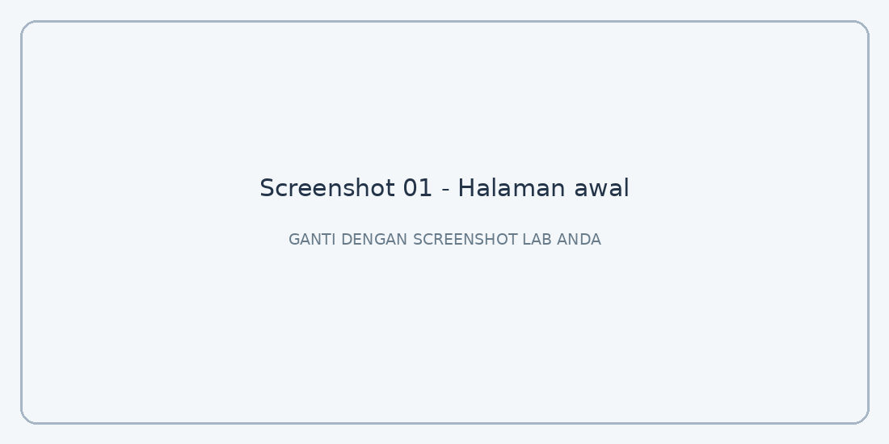
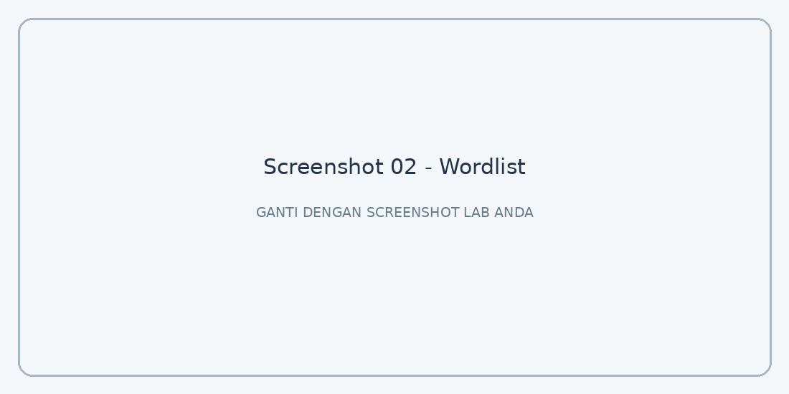
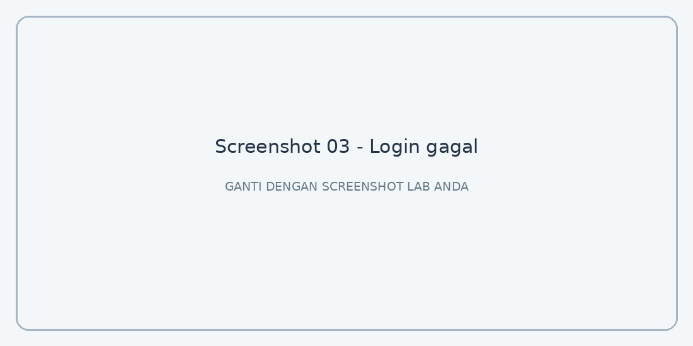
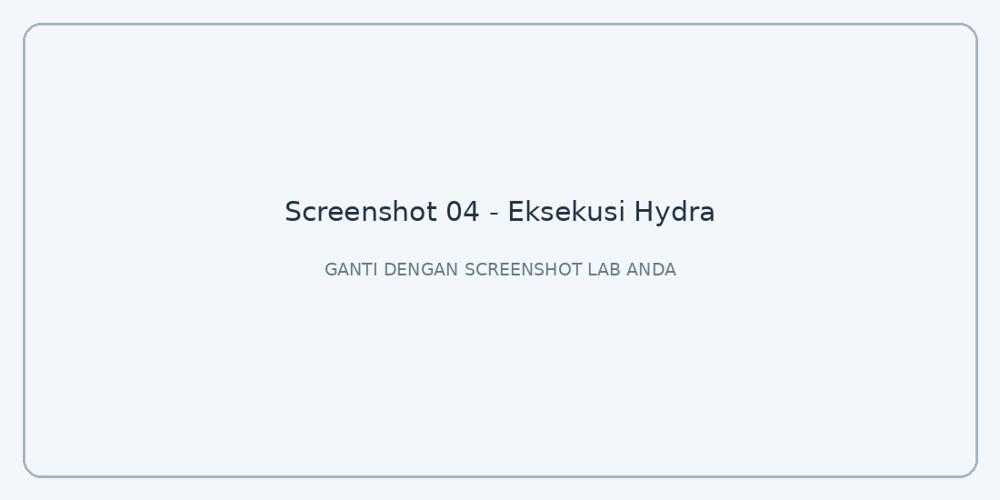
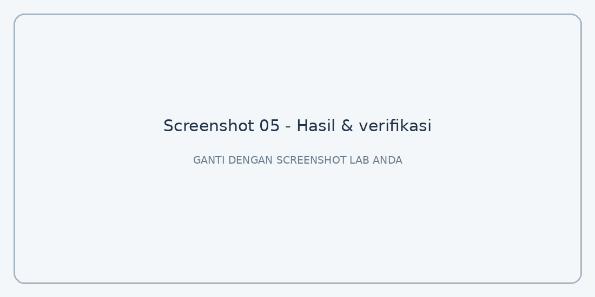

# Lab 04 — Dictionary Attack Menggunakan Hydra

> **XCODE Pentest Learning Notes — Exam 01**  
> **Status:** Selesai (berdasarkan catatan latihan)  
> **Lingkungan:** Lab pentest yang diizinkan

## 1. Ringkasan Lab

Pada Lab 04 (`/ujianmouse`), saya mempelajari pengujian keamanan autentikasi dengan **dictionary attack** menggunakan **THC Hydra**. Berbeda dengan Lab 02 yang mencoba melewati autentikasi melalui SQL Injection, lab ini menguji kombinasi username dan password yang berasal dari *wordlist* yang disediakan dalam lingkungan latihan.

| Informasi | Keterangan |
|---|---|
| Exam | 01 |
| Lab | 04 |
| Target | `/ujianmouse` |
| IP server lab | `192.168.39.87` |
| Alamat melalui tunnel | `http://localhost:8080/ujianmouse/` |
| Endpoint login | `/ujianmouse/index.php` |
| Metode | Dictionary attack terhadap form login HTTP POST |
| Tools | cURL, THC Hydra, browser atau terminal |
| Wordlist | `user.txt` dan `wordlist.txt` |
| Indikator login gagal | `Login gagal.` |

**Tujuan:** Mengidentifikasi kombinasi username dan password yang valid pada form login yang disediakan dalam cakupan lab, sekaligus mempelajari cara menafsirkan respons HTTP secara akurat.

> **Batasan:** Gunakan metode ini hanya pada sistem yang memberikan izin pengujian. Hindari memasukkan kredensial yang ditemukan, data pribadi, atau tautan lab privat ke repository publik.

## 2. Tujuan Pembelajaran

Setelah menyelesaikan lab ini, saya diharapkan memahami:

- Perbedaan **dictionary attack** dan **brute force**.
- Fungsi *username wordlist* dan *password wordlist*.
- Cara kerja HTTP POST pada form login.
- Mengapa HTTP `200 OK` belum tentu menunjukkan autentikasi berhasil.
- Cara menggunakan indikator kegagalan yang tepat pada Hydra.
- Risiko *false positive* dan pentingnya verifikasi hasil.
- Mitigasi yang dapat diterapkan untuk mengurangi serangan login otomatis.

## 3. Lingkungan dan Akses Target

Target berada pada jaringan internal lab. Dalam pengujian ini, akses dari laptop dilakukan melalui SSH tunnel sehingga web server dapat dijangkau lewat `localhost:8080`.

```text
Laptop penguji
    |
    | http://localhost:8080
    v
SSH tunnel melalui VPS
    |
    v
192.168.39.87:80
    |
    v
/ujianmouse/
```

> **Catatan:** `localhost:8080` di sini merupakan alamat lokal laptop yang diteruskan ke server lab. Jika menjalankan perintah langsung di VPS tanpa tunnel, alamat host dan port perlu disesuaikan.

**Bukti 01 — Halaman awal:**



> Ganti gambar di atas dengan screenshot halaman login `/ujianmouse`.

## 4. Persiapan Wordlist

Lab menyediakan dua berkas:

| Berkas | Isi |
|---|---|
| `user.txt` | Daftar kandidat username |
| `wordlist.txt` | Daftar kandidat password |

Saya mengunduh keduanya ke komputer lokal menggunakan cURL. Berikut contoh jika file tersedia di bawah path `/ujianmouse/`:

```powershell
curl.exe -O http://localhost:8080/ujianmouse/user.txt
curl.exe -O http://localhost:8080/ujianmouse/wordlist.txt
```

> Lokasi unduhan di atas adalah **contoh**. Jika file pada lab berada di lokasi lain, gunakan URL yang benar sesuai halaman lab. Pada PowerShell, `curl.exe` memanggil executable cURL secara eksplisit.

Untuk memastikan kedua berkas sudah tersimpan, periksa direktori kerja:

**PowerShell:**

```powershell
Get-ChildItem user.txt, wordlist.txt
```

**Linux/macOS:**

```bash
ls -lh user.txt wordlist.txt
```

**Bukti 02 — Wordlist berhasil diunduh:**



> Ganti dengan screenshot terminal yang menampilkan kedua file, tanpa perlu memublikasikan seluruh isi wordlist.

## 5. Menganalisis Respons Login

Sebelum menjalankan Hydra, saya memeriksa bagaimana aplikasi merespons login dengan kredensial salah.

**Hasil pengamatan:**

- Respons HTTP tetap `200 OK` ketika login gagal.
- Body HTML mengandung teks **`Login gagal.`** ketika kredensial tidak cocok.
- Karena itu, status HTTP saja tidak bisa dijadikan indikator keberhasilan login.

Ilustrasi respons gagal:

```http
HTTP/1.1 200 OK
Content-Type: text/html

Login gagal.
```

Poin penting: **`200 OK` berarti request berhasil diproses oleh server, bukan berarti pengguna berhasil login.** Untuk lab ini, isi response body menjadi indikator kegagalan.

**Bukti 03 — Respons login gagal:**



> Ganti dengan screenshot respons atau halaman yang menunjukkan pesan `Login gagal.`.

## 6. Menjalankan Hydra

Setelah mengetahui lokasi endpoint, nama parameter form, dan pesan login gagal, saya menggunakan perintah berikut:

```bash
hydra -L user.txt -P wordlist.txt localhost -s 8080 \
  http-post-form \
  "/ujianmouse/index.php:user=^USER^&pass=^PASS^:F=Login gagal."
```

Perintah di atas dijalankan dalam lingkungan lab yang telah diizinkan.

### Penjelasan parameter

| Bagian | Fungsi |
|---|---|
| `hydra` | Menjalankan THC Hydra. |
| `-L user.txt` | Membaca daftar kandidat username dari berkas. |
| `-P wordlist.txt` | Membaca daftar kandidat password dari berkas. |
| `localhost` | Host lokal yang diarahkan ke server lab melalui tunnel. |
| `-s 8080` | Menentukan port tujuan. |
| `http-post-form` | Memilih modul pengujian form login HTTP POST. |
| `/ujianmouse/index.php` | Path endpoint login. |
| `user=^USER^` | Mengisi parameter `user` menggunakan kandidat username. |
| `pass=^PASS^` | Mengisi parameter `pass` menggunakan kandidat password. |
| `F=Login gagal.` | Menandai respons yang berisi pesan kegagalan. |

**Alur konseptual:**

```text
user.txt + wordlist.txt
         |
         v
Hydra menyusun kombinasi kandidat
         |
         v
HTTP POST /ujianmouse/index.php
         |
         v
Analisis response body
         |
         +--> Mengandung "Login gagal." --> Kombinasi gagal
         |
         +--> Tidak mengandung teks itu --> Kandidat berhasil,
                                             perlu verifikasi
```

**Bukti 04 — Eksekusi Hydra:**



> Ganti dengan screenshot proses Hydra. Sensor password, cookie, dan informasi sensitif lain sebelum publikasi.

## 7. Mengapa `F=Login gagal.` Penting?

Dalam modul `http-post-form`, bagian `F=` digunakan untuk menentukan **indikator kegagalan**. Hydra menganggap respons yang cocok dengan indikator tersebut sebagai login gagal.

```text
F=Login gagal.
```

Teks indikator harus sesuai dengan output aplikasi. Perbedaan huruf besar/kecil, spasi, atau tanda baca dapat membuat pencocokan gagal.

Contohnya, string berikut **tidak identik**:

```text
Login gagal.
login gagal
Login gagal
```

Jika indikator salah, Hydra bisa melaporkan banyak kombinasi sebagai berhasil, padahal login sebenarnya gagal. Hasil seperti ini disebut **false positive**.

Sebaliknya, ketika suatu respons tidak mengandung pesan kegagalan, hasilnya belum tentu sukses: aplikasi mungkin menampilkan error, mengubah format halaman, atau melakukan redirect. Karena itu, kandidat hasil Hydra perlu dicek melalui proses login normal.

## 8. Hasil Pengujian

Dari catatan latihan, tahapan berikut telah dilakukan:

| Tahap | Hasil |
|---|---|
| Mengunduh wordlist | Selesai |
| Mengidentifikasi respons login gagal | Selesai |
| Menentukan string kegagalan | `Login gagal.` |
| Menyusun dan menjalankan command Hydra | Selesai |
| Kredensial hasil Hydra | **Tidak dicantumkan dalam catatan** |
| Bukti login manual menggunakan kredensial hasil | **Belum dilampirkan** |

> Catatan dokumentasi: ringkasan latihan menyatakan pengujian telah diselesaikan, tetapi tidak menyertakan pasangan kredensial atau screenshot verifikasi. Isi bukti di bawah setelah tersedia; jangan mengarang hasil.

**Bukti 05 — Hasil Hydra dan verifikasi login:**



> Simpan screenshot hasil yang sudah disensor. Jika ingin mencatat pasangan username/password untuk kebutuhan pribadi, simpan secara terpisah di tempat aman, bukan dalam repository publik.

## 9. Konsep Keamanan yang Dipelajari

### 9.1 Dictionary Attack vs Brute Force

- **Dictionary attack** mencoba kandidat dari daftar kata atau kredensial yang telah disiapkan.
- **Brute force** dalam arti luas mencoba banyak kemungkinan secara sistematis; ketika semua kombinasi karakter dihasilkan, ruang pencariannya jauh lebih besar.

Lab ini menggunakan dua wordlist, sehingga metode yang paling tepat disebut **dictionary attack terhadap form login**.

### 9.2 HTTP Status vs Authentication Status

HTTP `200 OK` hanya menyatakan bahwa permintaan diproses pada level HTTP. Keberhasilan autentikasi perlu diidentifikasi melalui indikator aplikasi yang lebih dapat dipercaya, misalnya respons sukses yang konsisten atau sesi login yang valid.

### 9.3 False Positive

Sebuah tool dapat melaporkan kandidat login berhasil ketika indikator yang dikonfigurasi tidak sesuai dengan respons sebenarnya. Verifikasi manual membantu memastikan bahwa kombinasi yang ditemukan benar-benar memberi akses sesuai tugas lab.

## 10. Dampak dan Mitigasi

Apabila sebuah aplikasi menerima percobaan login berulang tanpa perlindungan yang memadai, password yang lemah atau umum dapat berisiko ditebak menggunakan wordlist.

Beberapa kontrol yang dapat diterapkan oleh developer:

1. **Rate limiting:** batasi frekuensi percobaan login dengan mempertimbangkan akun, IP, dan pola aktivitas.
2. **Multi-factor authentication (MFA):** tambah faktor autentikasi agar password saja tidak cukup.
3. **Pemeriksaan password:** larang password yang umum atau diketahui telah bocor.
4. **Monitoring dan logging:** deteksi lonjakan kegagalan login dan pola otomatisasi.
5. **Perlindungan berbasis risiko:** gunakan penundaan atau challenge tambahan secara proporsional; hindari mekanisme yang mudah disalahgunakan untuk mengunci akun orang lain.

Referensi pembelajaran:

- [OWASP Authentication Cheat Sheet](https://cheatsheetseries.owasp.org/cheatsheets/Authentication_Cheat_Sheet.html)
- [OWASP Blocking Brute Force Attacks Cheat Sheet](https://cheatsheetseries.owasp.org/cheatsheets/Blocking_Brute_Force_Attacks_Cheat_Sheet.html)

## 11. Hubungan dengan Lab Sebelumnya

| Lab | Materi | Konsep utama |
|---|---|---|
| 00 | SSH & Tunneling | Mengakses jaringan internal lab |
| 01 | Path Traversal | Memanipulasi lokasi file |
| 02 | SQL Injection | Mengubah logika query autentikasi |
| 03 | IDOR | Memeriksa izin akses terhadap object |
| 04 | Dictionary Attack | Menguji kombinasi kredensial secara otomatis |

Lab 02 berfokus pada perubahan logika SQL. Lab 04 berfokus pada pengujian kredensial melalui request autentikasi normal yang diotomatisasi.

## 12. Checklist Pemahaman

- [ ] Saya dapat menjelaskan perbedaan dictionary attack dan brute force.
- [ ] Saya mengetahui fungsi `user.txt` dan `wordlist.txt`.
- [ ] Saya memahami request HTTP POST pada form login.
- [ ] Saya tahu mengapa `200 OK` tidak berarti login berhasil.
- [ ] Saya memahami fungsi `-L`, `-P`, `-s`, dan `http-post-form`.
- [ ] Saya dapat menjelaskan fungsi `^USER^` dan `^PASS^`.
- [ ] Saya memahami indikator `F=Login gagal.`.
- [ ] Saya memahami risiko false positive.
- [ ] Saya dapat menyebutkan mitigasi terhadap login otomatis.

## 13. Kesimpulan

Pada Lab 04, saya mempelajari cara menjalankan dictionary attack menggunakan Hydra dengan dua wordlist dan cara menganalisis respons autentikasi. Temuan pentingnya adalah aplikasi mengembalikan HTTP `200 OK` meskipun login gagal, sehingga keberhasilan tidak boleh dinilai dari status HTTP saja.

Konfigurasi `F=Login gagal.` membuat Hydra menggunakan pesan kegagalan pada body HTML untuk mengklasifikasikan hasil percobaan. Namun, keluaran tool tetap perlu diverifikasi agar tidak salah menganggap respons yang berbeda sebagai login berhasil.

**Pelajaran utama:** memahami perilaku respons aplikasi dan memverifikasi hasil sama pentingnya dengan memahami command serta opsi tool yang digunakan.

---

## Cheat Sheet

```text
LAB           : 04
PATH          : /ujianmouse
CATEGORY      : Authentication Testing
TECHNIQUE     : Dictionary Attack
TOOL          : THC Hydra
WORDLIST      : user.txt, wordlist.txt
ENDPOINT      : /ujianmouse/index.php
METHOD        : POST
FAIL STRING   : Login gagal.
MAIN LESSON   : HTTP 200 bukan bukti login berhasil
MAIN DEFENSE  : Rate limiting, MFA, password policy, monitoring
```
