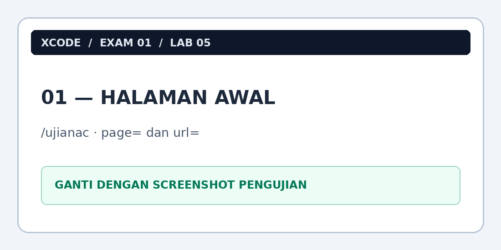
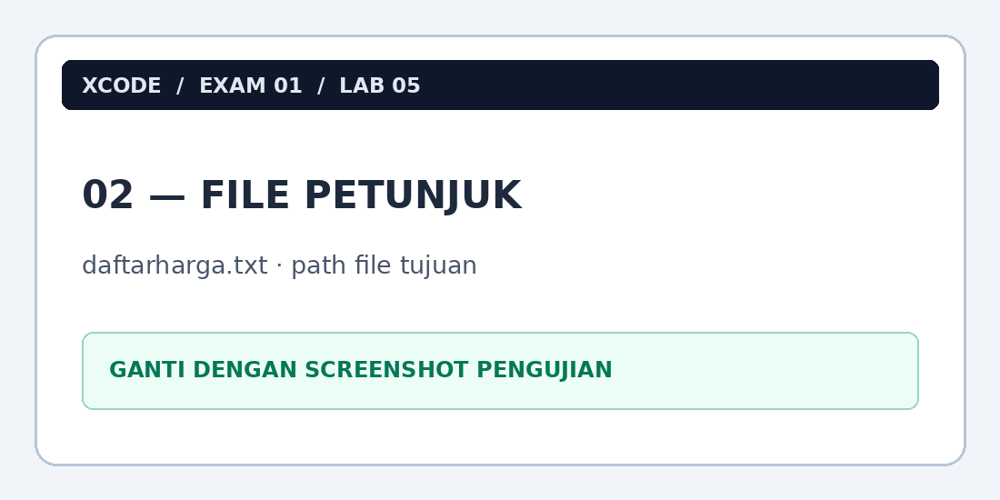
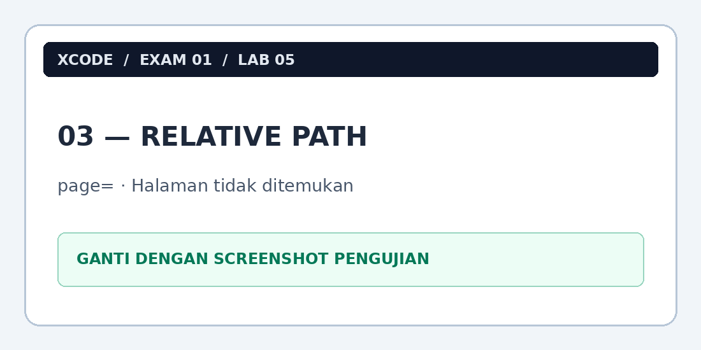
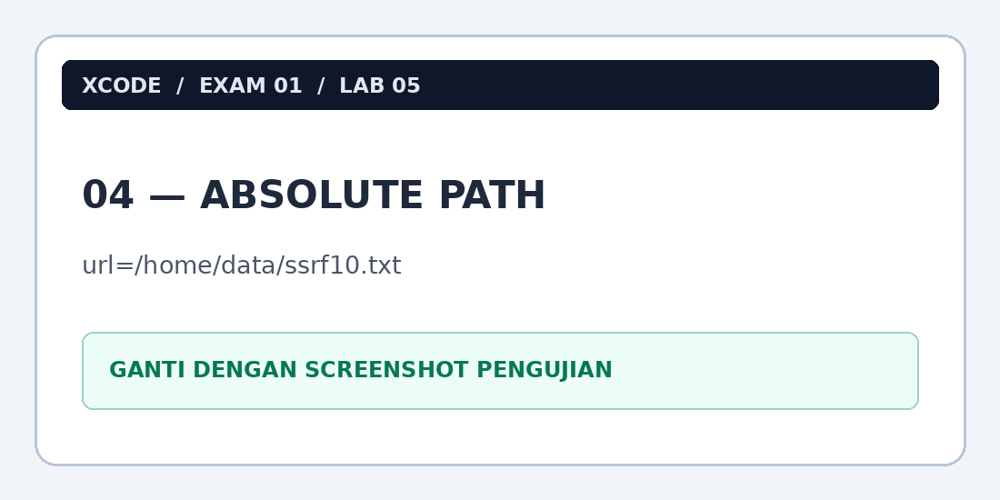
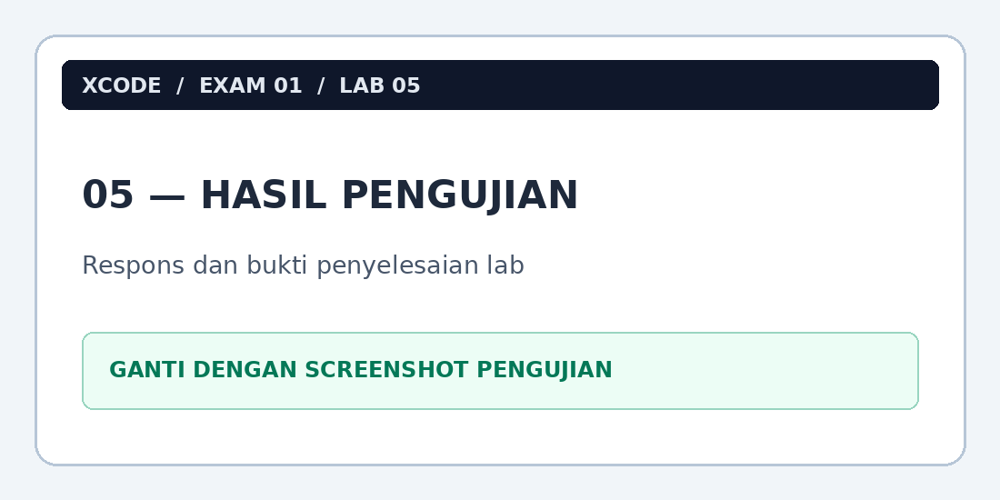

# Lab 05 — Arbitrary File Read melalui Parameter `url`

> **XCODE Pentest Learning Notes — Exam 01**  
> **Status:** Selesai (berdasarkan catatan latihan)  
> **Lingkungan:** Lab pentest yang diizinkan

## 1. Ringkasan Lab

Pada Lab 05 (`/ujianac`), saya mempelajari bagaimana parameter URL yang memuat file dapat digunakan untuk membaca file lokal di luar direktori aplikasi ketika tidak ada pembatasan akses yang memadai. Saya menemukan dua parameter, `page=` dan `url=`. Percobaan *relative path* melalui `page=` tidak berhasil, sedangkan *absolute path* melalui `url=` berhasil menampilkan file tujuan.

| Informasi | Keterangan |
|---|---|
| Exam | 01 |
| Lab | 05 |
| Target | `/ujianac` |
| IP server lab | `192.168.39.87` |
| Alamat melalui tunnel | `http://localhost:8080/ujianac/` |
| Parameter yang diamati | `page`, `url` |
| File petunjuk | `daftarharga.txt` |
| File tujuan | `/home/data/ssrf10.txt` |
| Teknik berhasil | Direct absolute path melalui `url=` |
| Temuan teramati | Arbitrary local file read |

**Tujuan:** Memahami fungsi parameter yang menerima lokasi file, perbedaan *relative* dan *absolute path*, serta pentingnya pembatasan file yang boleh dibaca aplikasi.

> **Batasan:** Gunakan hanya pada sistem yang mengizinkan pengujian. Jangan memublikasikan isi file internal, token, atau detail akses privat yang ditemukan selama latihan.

## 2. Tujuan Pembelajaran

Setelah menyelesaikan lab ini, saya diharapkan memahami:

- Perbedaan fungsi parameter `page=` dan `url=` berdasarkan perilaku yang diamati.
- Perbedaan *relative path* dan *absolute path* pada Linux.
- Cara *file handling* yang tidak aman dapat menyebabkan **arbitrary file read**.
- Mengapa nama file `ssrf10.txt` tidak otomatis membuktikan SSRF.
- Perbedaan konsep **Path Traversal**, **LFI**, dan **Arbitrary File Read**.
- Mitigasi melalui *allowlist*, pemeriksaan path, dan *least privilege*.

## 3. Lingkungan dan Akses Target

Target berada pada jaringan internal lab. Seperti Lab 04, contoh URL dalam dokumentasi ini menggunakan SSH tunnel agar server lab dapat diakses melalui `localhost:8080`.

```text
Laptop penguji
    |
    | http://localhost:8080
    v
SSH tunnel melalui VPS
    |
    v
192.168.39.87:80
    |
    v
/ujianac/
```

Contoh membuka halaman melalui terminal lokal setelah tunnel aktif:

```bash
curl -i http://localhost:8080/ujianac/
```

> `localhost:8080` adalah endpoint tunnel pada laptop, bukan IP server target. Bila mengakses dari VPS tanpa tunnel, gunakan alamat internal dan port yang sesuai dengan environment lab.

**Bukti 01 — Halaman awal dan parameter yang terlihat:**



> Ganti dengan screenshot halaman `/ujianac` yang memperlihatkan tautan atau navigasi terkait `page=` dan `url=`.

## 4. Identifikasi Parameter

Pada halaman terdapat dua parameter dengan perilaku yang berbeda:

| Parameter | Pengamatan selama lab |
|---|---|
| `page=` | Percobaan menggunakan relative path menampilkan pesan **Halaman tidak ditemukan**. |
| `url=` | Digunakan untuk membuka file petunjuk; menerima absolute path file tujuan. |

Dari sini saya belajar bahwa dua parameter yang sama-sama tampak berhubungan dengan navigasi **belum tentu diproses oleh fungsi backend yang sama**.

```text
Request ke /ujianac/
        |
        +--> page=... --> Percobaan relative path gagal
        |
        +--> url=...  --> File tujuan berhasil dimuat
```

> Diagram ini menggambarkan hasil pengamatan, **bukan** kode backend asli. Tanpa akses source code, saya tidak dapat memastikan fungsi PHP apa yang dipakai setiap parameter.

## 5. Membaca File Petunjuk

Melalui fitur pemuatan file pada halaman, saya membuka `daftarharga.txt`. Di dalamnya ditemukan petunjuk lokasi file tujuan pada Linux:

```text
/home/data/ssrf10.txt
```

Path tersebut bersifat **absolute** karena dimulai dari direktori akar (`/`). Artinya lokasi file sudah dinyatakan dari root filesystem dan tidak perlu dihitung relatif terhadap direktori awal aplikasi.

**Bukti 02 — Isi `daftarharga.txt`:**



> Ganti dengan screenshot petunjuk yang menunjukkan path file tujuan. Sensor bagian lain jika mengandung informasi privat.

## 6. Percobaan Awal Menggunakan Relative Path

Saya terlebih dahulu mencoba mengakses file melalui `page=` dengan pola relative path, misalnya:

```text
../../../../home/data/ssrf10.txt
```

Setiap `../` mencoba berpindah satu tingkat ke direktori induk. Namun, pada pengujian ini aplikasi memberikan respons:

```text
Halaman tidak ditemukan
```

**Bukti 03 — Percobaan yang tidak berhasil:**



> Ganti dengan screenshot URL yang diuji beserta pesan **Halaman tidak ditemukan**.

Kegagalan ini tidak otomatis berarti `page=` aman. Bisa saja fungsi tersebut menggunakan pemetaan halaman, validasi tertentu, atau pemrosesan berbeda. Kesimpulan yang dapat saya catat adalah **percobaan tersebut tidak berhasil dalam kondisi lab saat itu**.

## 7. Metode yang Berhasil: Direct Absolute Path

Setelah menemukan lokasi file tujuan, saya menggunakan path absolut langsung pada parameter `url=`:

```text
http://localhost:8080/ujianac/?url=/home/data/ssrf10.txt
```

Jika ingin menampilkan respons dari terminal dalam lab yang sama:

```bash
curl -i 'http://localhost:8080/ujianac/?url=/home/data/ssrf10.txt'
```

**Penjelasan URL:**

| Bagian | Fungsi |
|---|---|
| `localhost:8080` | Host dan port lokal yang diteruskan melalui SSH tunnel. |
| `/ujianac/` | Path aplikasi lab. |
| `url=` | Parameter yang menerima lokasi file. |
| `/home/data/ssrf10.txt` | Absolute path file tujuan pada server Linux. |

**Struktur lokasi file secara konseptual:**

```text
/
└── home/
    └── data/
        └── ssrf10.txt
```

Karena path tersebut sudah dimulai dari `/`, saya tidak memerlukan rangkaian `../` seperti pada Lab 01. Berdasarkan catatan latihan, request ini berhasil menghasilkan respons yang berisi file tujuan.

**Bukti 04 — Akses file berhasil:**



> Ganti dengan screenshot URL dan respons saat file tujuan berhasil dibaca. Hindari memublikasikan isi sensitif atau tautan privat yang mungkin terdapat di dalam file.

## 8. Mengapa Teknik Ini Berhasil?

Dari perilaku yang teramati, aplikasi menerima lokasi file dari parameter `url=` dan dapat membaca file yang berada di luar direktori halaman web normal. Jika pengguna dapat memberikan path yang tidak dibatasi, kontrol atas file yang dibaca berpindah dari aplikasi kepada input pengguna.

```text
User mengisi parameter url=
            |
            v
Backend memproses path file
            |
            v
Path file di luar direktori aplikasi diterima
            |
            v
Filesystem: /home/data/ssrf10.txt
            |
            v
Konten file ditampilkan dalam respons
```

Masalah yang **terbukti dari hasil lab** adalah **Arbitrary Local File Read**. Istilah **LFI (Local File Inclusion)** sering dipakai dalam konteks aplikasi PHP yang memasukkan file berdasarkan input pengguna, tetapi penggunaan `include()` belum dapat dipastikan tanpa melihat implementasi backend. Jika backend hanya memakai fungsi baca file, istilah *arbitrary file read* lebih spesifik.

**Catatan:** Walaupun file tujuan bernama `ssrf10.txt`, nama tersebut tidak membuktikan **SSRF (Server-Side Request Forgery)**. SSRF memerlukan bukti bahwa server dipicu membuat permintaan ke alamat atau layanan lain; hasil lab ini menunjukkan pembacaan file lokal.

## 9. Perbandingan dengan Lab 01

| Aspek | Lab 01 | Lab 05 |
|---|---|---|
| Path aplikasi | `/ujianmonitor` | `/ujianac` |
| Parameter yang digunakan | `page=` | `url=` |
| Teknik yang digunakan | Relative path dengan `../` | Direct absolute path |
| Contoh lokasi file | `../../../../home/data/linkwa.txt` | `/home/data/ssrf10.txt` |
| Pelajaran utama | Memahami traversal dari direktori awal | Memahami parameter file yang menerima absolute path |

Kedua lab berkaitan dengan pengendalian lokasi file melalui input pengguna, tetapi **cara pencapaian file tujuan berbeda**. Lab 01 bergantung pada perpindahan direktori relatif; Lab 05 berhasil menggunakan lokasi file yang sudah diketahui secara lengkap.

## 10. Root Cause dan Mitigasi

Akar masalah yang paling mungkin adalah **parameter `url=` tidak dibatasi pada daftar file yang secara eksplisit diizinkan**. Backend yang benar seharusnya memutuskan file mana yang dapat dibaca, bukan mempercayai path arbitrer dari pengguna.

### 10.1 Gunakan allowlist

Contoh PHP defensif ketika aplikasi memang perlu menampilkan file statis tertentu:

```php
<?php
$allowedFiles = [
    'daftarharga.txt' => __DIR__ . '/files/daftarharga.txt',
    'brosur.pdf'      => __DIR__ . '/files/brosur.pdf',
];

$file = $_GET['url'] ?? '';

if (!array_key_exists($file, $allowedFiles)) {
    http_response_code(403);
    exit('Akses ditolak.');
}

$path = $allowedFiles[$file];

if (!is_file($path) || !is_readable($path)) {
    http_response_code(404);
    exit('File tidak ditemukan.');
}

readfile($path);
```

Pada contoh ini, pengguna memilih **identifier file** yang sudah terdaftar. File sistem yang sebenarnya ditentukan oleh aplikasi. Fungsi `readfile()` digunakan untuk menampilkan konten file, bukan mengeksekusi kode PHP seperti yang dapat terjadi dengan `include()`.

### 10.2 Terapkan least privilege

- Berikan akun proses web server, misalnya `www-data`, hanya permission yang benar-benar diperlukan.
- Jangan memberi akses baca ke file privat yang tidak relevan dengan aplikasi.
- Pisahkan dokumen rahasia dan file yang memang boleh disajikan oleh aplikasi.
- Gunakan pemeriksaan path yang aman jika aplikasi memiliki kebutuhan sah untuk membuka file dinamis.

> Tidak semua akses ke `/home/` atau `/etc/` perlu atau mungkin diblokir secara menyeluruh. Tentukan izin berdasarkan kebutuhan proses dan sistem operasi.

Referensi pembelajaran:

- [OWASP Path Traversal](https://owasp.org/www-community/attacks/Path_Traversal)
- [OWASP File Inclusion](https://owasp.org/www-community/attacks/Testing_for_Local_File_Inclusion)

## 11. Hasil Pengujian dan Finding

| Tahap | Hasil |
|---|---|
| Membuka halaman `/ujianac` | Selesai |
| Mengidentifikasi `page=` dan `url=` | Selesai |
| Membaca `daftarharga.txt` | Selesai |
| Menemukan path `/home/data/ssrf10.txt` | Selesai |
| Percobaan relative path melalui `page=` | Tidak berhasil |
| Menggunakan absolute path melalui `url=` | Berhasil |
| Isi detail file tujuan | Tidak disertakan dalam catatan |

**Ringkasan temuan:**

```text
LAB            : 05
PATH           : /ujianac
CATEGORY       : File Handling
FINDING        : Arbitrary Local File Read
PARAMETER      : url
TECHNIQUE      : Direct Absolute Path
TARGET FILE    : /home/data/ssrf10.txt
OBSERVED       : Konten file tujuan berhasil diakses
ROOT CAUSE     : Pembatasan akses path tidak memadai (dugaan)
MAIN DEFENSE   : Allowlist, path validation, least privilege
```

**Bukti 05 — Ringkasan bukti dan verifikasi hasil:**



> Isi dengan screenshot yang membuktikan penyelesaian lab. Jika informasi dalam file adalah petunjuk ke tahap lain, sensor bagian privat sebelum mengunggahnya ke repository publik.

## 12. Hubungan dengan Lab Sebelumnya

| Lab | Materi | Konsep utama |
|---|---|---|
| 00 | SSH & Tunneling | Mengakses jaringan internal lab |
| 01 | Path Traversal | Memanipulasi lokasi file menggunakan `../` |
| 02 | SQL Injection | Mengubah logika query autentikasi |
| 03 | IDOR | Memeriksa authorization terhadap object |
| 04 | Dictionary Attack | Menguji kombinasi kredensial secara otomatis |
| 05 | Arbitrary File Read | Menguji pembatasan pembacaan file lokal |

## 13. Checklist Pemahaman

- [ ] Saya memahami perbedaan parameter `page=` dan `url=` berdasarkan respons aplikasi.
- [ ] Saya dapat menjelaskan perbedaan relative path dan absolute path.
- [ ] Saya memahami fungsi `../` pada filesystem Linux.
- [ ] Saya mengetahui mengapa kegagalan satu payload tidak membuktikan parameter aman.
- [ ] Saya dapat menjelaskan apa itu arbitrary local file read.
- [ ] Saya mengetahui kapan istilah LFI tepat digunakan.
- [ ] Saya memahami mengapa nama file `ssrf10.txt` bukan bukti SSRF.
- [ ] Saya dapat menjelaskan mitigasi allowlist dan least privilege.

## 14. Kesimpulan

Pada Lab 05, saya menemukan bahwa aplikasi menyediakan dua parameter dengan perilaku berbeda, yaitu `page=` dan `url=`. Percobaan menggunakan relative path pada `page=` tidak berhasil, tetapi akses melalui `url=` dengan absolute path `/home/data/ssrf10.txt` berhasil menampilkan file tujuan.

Dari latihan ini saya memahami bahwa keberhasilan pengujian tidak hanya bergantung pada bentuk path, melainkan juga **parameter dan fungsi backend yang memproses input**. File yang berada di luar direktori aplikasi dapat terekspos ketika backend menerima lokasi file yang dikendalikan pengguna tanpa batasan akses yang memadai.

**Pelajaran utama:** jangan mempercayai path yang diberikan pengguna. Tentukan file yang boleh dibaca melalui allowlist dan batasi permission proses web server.

---

## Cheat Sheet

```text
LAB           : 05
PATH          : /ujianac
CATEGORY      : File Handling
TECHNIQUE     : Direct Absolute Path
PARAMETER     : url
HINT FILE     : daftarharga.txt
TARGET FILE   : /home/data/ssrf10.txt
WORKING URL   : http://localhost:8080/ujianac/?url=/home/data/ssrf10.txt
RESULT        : File lokal berhasil diakses
MAIN DEFENSE  : Allowlist + Least Privilege
```
