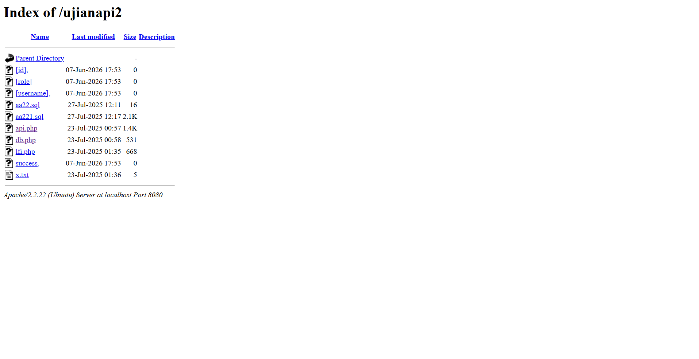
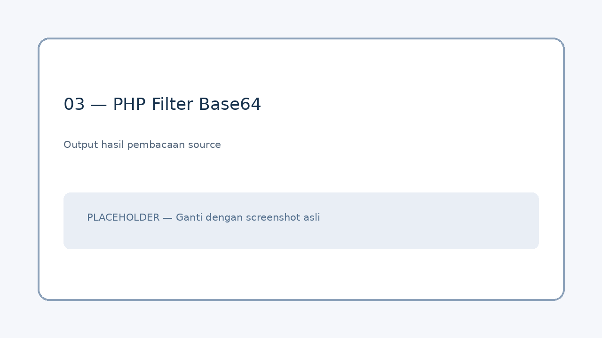
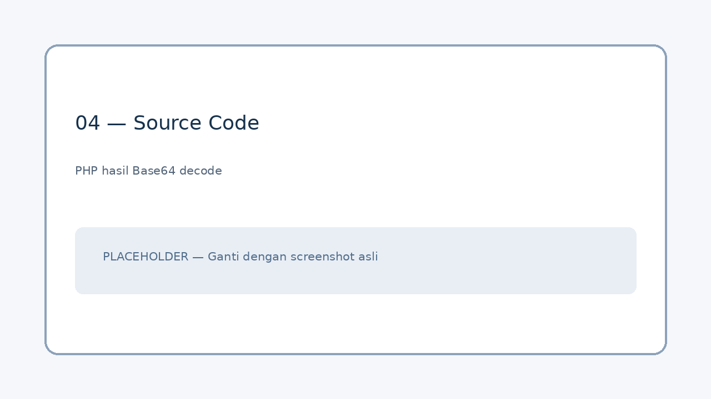
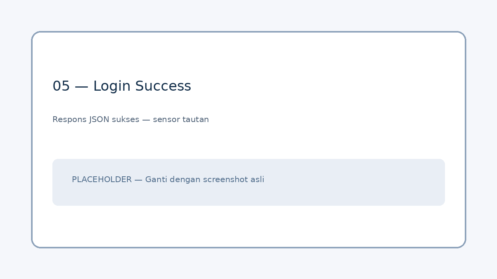

# Lab 07 — Source Code Disclosure & SQL Injection pada API

  

> **Lingkup:** Dokumentasi hasil latihan di lingkungan XCODE yang diizinkan. Alamat `localhost:8080` dalam catatan ini merupakan port lokal SSH tunnel menuju server lab `192.168.39.87`. Sensor credential, token, dan tautan undangan ketika memublikasikan dokumentasi.

## 1. Informasi Lab

| Informasi | Keterangan |
|---|---|
| Exam / Lab | Exam 01 / Lab 07 |
| Target | `/ujianapi2/` |
| IP server lab | `192.168.39.87` |
| Akses melalui tunnel | `http://localhost:8080/ujianapi2/` |
| API endpoint | `/ujianapi2/api.php` |
| Entry point yang digunakan untuk membaca file | `/ujianac/?url=` (temuan Lab 05) |
| Teknik | Directory Listing, PHP Filter, Source Code Disclosure, SQL Injection |
| Hasil | Login API mengembalikan `status: success` dan data akun berperan `admin` |
| Status | **Solved** |

## 2. Tujuan Pembelajaran

- Memahami **directory listing** dan mengidentifikasi file aplikasi dari halaman indeks direktori.
- Membedakan respons **eksekusi PHP** dengan **pembacaan source code PHP**.
- Memahami fungsi PHP stream wrapper `php://filter` serta filter `convert.base64-encode`.
- Melakukan **Base64 decoding** agar source code hasil pembacaan dapat dianalisis.
- Menganalisis query SQL yang dibuat menggunakan *string interpolation* dari input pengguna.
- Memahami SQL Injection berbasis kondisi selalu benar (*tautology*) dan komentar `#`.
- Mengenali indikasi **Broken Object-Level Authorization (BOLA/IDOR)** pada endpoint lain, tanpa menganggapnya terbukti jika belum diuji.

## 3. Environment dan Clue

Petunjuk awal lab:

```text
http://192.168.39.87/ujianapi2/api.php?action=login&username=x&password=x
```

Akses yang digunakan dalam catatan ini:

```text
Laptop / browser
    |
    v
localhost:8080
    |
    v
SSH tunnel melalui VPS
    |
    v
192.168.39.87:80
    |
    v
/ujianapi2/
```

**Catatan:** Target dan parameter di atas berasal dari lab yang diizinkan. Pada lingkungan lain, pengujian hanya dilakukan dalam ruang lingkup yang telah disetujui.



*Screenshot 01 — Tampilan `Index of /ujianapi2` dan daftar file yang terlihat.*

## 4. Reconnaissance: Directory Listing

Saya menghapus bagian `api.php` dan query string dari URL petunjuk untuk melihat direktori induknya:

```text
http://localhost:8080/ujianapi2/
```

Server menampilkan halaman:

```text
Index of /ujianapi2
```

Halaman ini disebut **directory listing**: web server menampilkan daftar file/direktori ketika tidak ada halaman indeks yang ditampilkan atau konfigurasi listing mengizinkannya. Dari daftar tersebut saya menemukan `api.php`.

> Directory listing merupakan *information exposure*, tetapi tidak otomatis berarti source code file PHP dapat dibaca. Ketika file PHP dibuka seperti halaman biasa, server umumnya **mengeksekusinya**, bukan mengirim source code.

## 5. Mengakses `api.php` Secara Normal

Saya membuka:

```text
http://localhost:8080/ujianapi2/api.php
```

Respons yang muncul:

```json
{
  "error": "Invalid action."
}
```

Respons ini memberi petunjuk bahwa `api.php` memerlukan parameter `action` yang valid. Mengunjungi endpoint tanpa parameter tidak memperlihatkan source code PHP, karena kode dieksekusi oleh server.


*Screenshot 02 — Respons JSON `Invalid action.` ketika `api.php` dibuka tanpa parameter.*

## 6. Membaca Source Code melalui Temuan Lab 05

Saya menggunakan kembali parameter `url=` pada endpoint `/ujianac/`, yang dalam Lab 05 telah terbukti dapat membaca file lokal. Kali ini nilainya berupa **PHP stream wrapper**:

```text
http://localhost:8080/ujianac/?url=php://filter/convert.base64-encode/resource=../ujianapi2/api.php
```

### Penjelasan bagian URL

| Bagian | Fungsi |
|---|---|
| `/ujianac/?url=` | Fitur pembacaan file yang ditemukan pada Lab 05 |
| `php://filter` | PHP stream wrapper untuk menerapkan filter ketika stream dibaca |
| `convert.base64-encode` | Mengubah konten yang dibaca menjadi Base64 |
| `resource=../ujianapi2/api.php` | Path relatif menuju source file target; lokasi relatif bergantung pada cara backend membuka file |

**Mengapa Base64?** Jika file PHP dimasukkan langsung melalui `include()`, PHP dapat mengeksekusi kode tersebut. Menggunakan filter Base64 dapat membuat isi file tersedia sebagai teks terenkode sehingga source code dapat dipelajari setelah di-*decode*. Perilaku pastinya bergantung pada implementasi pembacaan file di backend.

Respons lab diawali dengan teks penanda dan deretan Base64, misalnya:

```text
Mengambil dari: php://filter/convert.base64-encode/resource=../ujianapi2/api.php

PD9waHAK...
```

Prefix `PD9waHAK` adalah representasi Base64 dari awal source PHP (`<?php` diikuti newline), yang dapat menjadi petunjuk awal bahwa kontennya benar-benar kode PHP. **Base64 bukan enkripsi**; ini hanya encoding yang dapat dibalik.



*Screenshot 03 — Hasil pembacaan `api.php` dalam bentuk Base64 (sensor bagian yang tidak ingin dibagikan).* 

## 7. Base64 Decoding

Setelah memisahkan deretan Base64 dari teks penanda respons, saya melakukan decoding agar source code dapat dibaca.

**Contoh dengan terminal Linux/macOS:**

```bash
# Tempel hanya deretan Base64 ke file ini.
base64 --decode api-base64.txt > api.php.txt
```

Di macOS, jika opsi `--decode` tidak tersedia pada versi `base64` yang digunakan:

```bash
base64 -D -i api-base64.txt -o api.php.txt
```

**Contoh menggunakan Python (lintas platform):**

```python
import base64
from pathlib import Path

encoded = Path("api-base64.txt").read_text(encoding="utf-8").strip()
source = base64.b64decode(encoded, validate=True)
Path("api.php.txt").write_bytes(source)
```

`api.php.txt` digunakan sebagai nama hasil decoding agar file source disimpan sebagai **teks untuk dianalisis**, bukan dijalankan.



*Screenshot 04 — Source code PHP setelah Base64 decoding.*

## 8. Source Code Analysis

Source code yang berhasil dibaca memperlihatkan dua aksi API:

| Action | Input | Hasil | Temuan |
|---|---|---|---|
| `login` | `username`, `password` via GET | `status`, `user_id`, `username`, `role` | **SQL Injection terbukti melalui pengujian** |
| `get_profile` | `user_id` via GET | Data profil | **Potensi IDOR/BOLA**; belum dibuktikan dalam catatan pengujian ini |

### 8.1 Endpoint login: SQL Injection

Potongan kode relevan dari lab:

```php
if (isset($_GET['action']) && $_GET['action'] == 'login') {
    $username = isset($_GET['username']) ? $_GET['username'] : '';
    $password = isset($_GET['password']) ? $_GET['password'] : '';

    $sql = "SELECT * FROM users WHERE username = '$username' AND password = '$password'";
    $result = $conn->query($sql);
    // ... pengembalian hasil dalam JSON ...
}
```

**Akar masalah:** `$username` dan `$password` dimasukkan langsung ke string SQL. Input pengguna dapat ditafsirkan sebagai bagian sintaks SQL, bukan hanya sebagai nilai data.

> Kode yang terlihat juga membandingkan password secara langsung di query. Pada aplikasi nyata, password sebaiknya disimpan dengan hash adaptif dan diverifikasi menggunakan fungsi yang sesuai, bukan disimpan/dibandingkan sebagai plaintext.

### 8.2 Endpoint get_profile: indikasi IDOR/BOLA

Potongan kode relevan:

```php
elseif (isset($_GET['action']) && $_GET['action'] == 'get_profile') {
    $user_id = isset($_GET['user_id']) ? (int)$_GET['user_id'] : 0;
    $sql = "SELECT id, username, role FROM users WHERE id = $user_id";
    $result = $conn->query($sql);
    // ... respons profil dalam JSON ...
}
```

Kode tersebut menerima `user_id` dari request dan melakukan pencarian berdasarkan ID. Pada potongan yang terlihat **tidak ada pemeriksaan sesi maupun izin untuk membaca profil**. Ini mengindikasikan potensi BOLA/IDOR. Akan tetapi, catatan Lab 07 ini **tidak menyertakan uji akses profil lintas pengguna**, sehingga finding tersebut harus diberi status *potential*, bukan *confirmed*.

## 9. SQL Injection: Authentication Bypass

Dari query login, saya mengidentifikasi bahwa input `username` dapat memutus string SQL dan mengubah kondisi `WHERE`. Payload yang berhasil pada lingkungan lab:

```text
' OR 1=1#
```

Ketika dimasukkan ke URL, karakter khusus menjadi *URL encoded*:

| Karakter | Encoding | Keterangan |
|---|---|---|
| `'` | `%27` | Menutup literal string username |
| spasi | `%20` | Pemisah token SQL |
| `#` | `%23` | Awal komentar pada MySQL; harus di-encode agar tidak dianggap fragmen URL |

URL yang digunakan:

```text
http://localhost:8080/ujianapi2/api.php?action=login&username=%27%20OR%201=1%23&password=x
```

### Mengapa bekerja?

Dengan asumsi query disusun persis seperti source code yang ditemukan, nilai username tadi menghasilkan bentuk SQL konseptual:

```sql
SELECT * FROM users
WHERE username = '' OR 1=1#' AND password = 'x'
```

Pada MySQL, `#` memulai komentar sampai akhir baris. Bagian pemeriksaan password setelah `#` tidak lagi berperan dalam query. Kondisi `1=1` selalu benar (*tautology*), sehingga query dapat mengembalikan baris user tanpa password yang benar.

**Catatan:** Jika ada banyak baris yang cocok, `fetch_assoc()` mengambil salah satu baris pertama dari hasil query. Tanpa `ORDER BY`, kode tidak menjamin akun mana yang akan dikembalikan. Pada pengujian ini respons yang teramati adalah akun dengan role `admin`; itu bukan jaminan bahwa setiap eksekusi akan memilih admin.

## 10. Hasil Pengujian

Respons dari pengujian yang kamu laporkan, dengan tautan undangan disensor:

```json
{
  "status": "success",
  "user_id": "1",
  "username": "https://chat.whatsapp.com/HI7blVxxx",
  "role": "admin"
}
```

Artinya endpoint API menerima request yang dimodifikasi dan mengembalikan respons sukses serta data akun dengan role `admin`. Dalam konteks lab, respons tersebut berisi petunjuk untuk melanjutkan ujian.

**Batas interpretasi:** Respons `success` membuktikan bahwa logika login API dapat dilewati dalam pengujian ini; namun catatan ini tidak membuktikan adanya sesi browser atau token yang bisa digunakan pada endpoint lain karena tidak ada bukti pengujian lanjutan terhadap sesi/token.



*Screenshot 05 — Respons JSON `status: success` dan `role: admin`; sensor link undangan sebelum publikasi.*

## 11. Rangkaian Penyelesaian

```text
Clue: /ujianapi2/api.php?action=login&username=x&password=x
              |
              v
Membuka /ujianapi2/ → directory listing
              |
              v
Menemukan api.php → "Invalid action" saat dibuka normal
              |
              v
Menggunakan /ujianac/?url=php://filter/...
              |
              v
Menerima source PHP dalam bentuk Base64
              |
              v
Base64 decoding → source code analysis
              |
              v
Menemukan query login yang rentan SQL Injection
              |
              v
Menguji tautology + SQL comment pada login API
              |
              v
Menerima JSON status: success, role: admin
```

## 12. Findings dan Root Cause

| Temuan | Status berdasarkan bukti | Akar masalah |
|---|---|---|
| Directory listing pada `/ujianapi2/` | Teramati | Web server menampilkan indeks direktori |
| Pembacaan source `api.php` melalui `/ujianac/?url=` | Terbukti | File path dikendalikan pengguna dan pembacaan tidak dibatasi dengan memadai |
| SQL Injection pada `action=login` | Terbukti | Query dibangun dengan interpolasi input `username` / `password` |
| Authentication bypass API | Terbukti melalui respons sukses | Query login dapat dimodifikasi oleh input |
| IDOR/BOLA pada `get_profile` | Potensial, berdasarkan source | Tidak tampak pemeriksaan otorisasi object dalam potongan yang ditemukan |

## 13. Mitigasi Defensif

### 13.1 Hindari source code disclosure

- Jangan mengizinkan input pengguna menentukan lokasi file yang dapat dibaca secara bebas.
- Gunakan **allowlist** nama file dan path yang ditetapkan server.
- Matikan directory listing pada direktori aplikasi bila tidak diperlukan.
- Terapkan permission filesystem seminimal mungkin dan pisahkan file sensitif dari area yang dapat diakses web.

### 13.2 Gunakan prepared statement untuk login

Contoh konsep perbaikan PHP menggunakan MySQLi dengan query terparameterisasi:

```php
$stmt = $conn->prepare("SELECT id, username, role, password_hash FROM users WHERE username = ?");
$stmt->bind_param("s", $username);
$stmt->execute();
$user = $stmt->get_result()->fetch_assoc();

if ($user && password_verify($password, $user['password_hash'])) {
    // Buat sesi/token menggunakan mekanisme autentikasi yang aman.
} else {
    // Kembalikan kegagalan autentikasi secara konsisten.
}
```

Gunakan `password_hash()` saat pendaftaran/perubahan password, dan `password_verify()` ketika login. Hindari pengiriman credential melalui query string GET; gunakan POST melalui HTTPS. POST sendiri **tidak** mencegah SQL Injection, sehingga prepared statement tetap wajib.

### 13.3 Terapkan authorization pada get_profile

- Pastikan pemanggil terautentikasi jika profil bukan data publik.
- Periksa apakah pemanggil memang boleh melihat `user_id` yang diminta.
- Jangan menganggap validasi `(int)` sebagai authorization: casting hanya membatasi tipe input, bukan hak akses.
- Terapkan pemeriksaan izin di sisi server untuk setiap object.

## 14. Hubungan dengan Lab Sebelumnya

| Lab | Konsep yang digunakan kembali di Lab 07 |
|---|---|
| Lab 00 — SSH Tunneling | Mengakses target melalui `localhost:8080` |
| Lab 02 — SQL Injection | Memahami manipulasi query autentikasi |
| Lab 03 / 06 — IDOR | Mengenali potensi kelemahan object-level authorization pada `get_profile` |
| Lab 05 — Arbitrary File Read | Membaca source file melalui parameter `url=` |

Lab 07 menunjukkan **vulnerability chaining**: kelemahan file read dari lab sebelumnya digunakan untuk memahami API lain, lalu hasil source code analysis membantu mengidentifikasi titik SQL Injection.

## 15. Checklist Pemahaman

- [ ] Dapat menjelaskan apa itu directory listing.
- [ ] Memahami mengapa membuka `api.php` biasa mengeksekusi kode, bukan menampilkan source-nya.
- [ ] Memahami fungsi `php://filter` dan `convert.base64-encode`.
- [ ] Dapat membedakan Base64 encoding dengan enkripsi.
- [ ] Memahami langkah Base64 decoding pada hasil lab.
- [ ] Mengetahui apa yang menyebabkan query login rentan SQL Injection.
- [ ] Memahami fungsi `%27`, `%20`, dan `%23` pada URL pengujian.
- [ ] Memahami operator `OR`, kondisi `1=1`, dan komentar `#` dalam query yang diuji.
- [ ] Bisa membedakan SQL Injection yang terbukti dari IDOR yang baru terindikasi.
- [ ] Memahami mitigasi: allowlist file, prepared statement, password hashing, dan authorization per object.

## 16. Pertanyaan Latihan

1. Mengapa URL `/ujianapi2/` menampilkan daftar file, tetapi `/ujianapi2/api.php` hanya menampilkan `Invalid action.`?
2. Mengapa `php://filter/convert.base64-encode` membantu melihat source code PHP dalam lab ini?
3. Mengapa Base64 bukan mekanisme kerahasiaan?
4. Apa peran `#` dalam payload SQLi, dan mengapa karakter itu ditulis sebagai `%23` pada URL?
5. Mengapa respons akun `admin` pada pengujian ini tidak menjamin semua eksekusi selalu mengembalikan akun admin?
6. Mengapa potongan `get_profile` mengindikasikan BOLA/IDOR, tetapi belum cukup untuk menyatakan temuan itu sudah terbukti melalui pengujian?

## 17. Kesimpulan

Dalam Lab 07 saya memulai dari URL petunjuk API, menemukan directory listing, lalu menggunakan fitur pembacaan file pada `/ujianac/` untuk mendapatkan source code `api.php` dalam bentuk Base64. Setelah decoding, saya menemukan query login yang menyisipkan input pengguna secara langsung ke SQL. Pengujian dengan kondisi selalu benar dan komentar SQL menghasilkan respons `status: success` dari API serta data akun berperan `admin`.

**Pelajaran utama:** kelemahan keamanan dapat saling memperkuat. Source code disclosure membuat pemetaan endpoint lebih mudah, sedangkan query yang tidak terparameterisasi memungkinkan authentication bypass. Perbaikan harus dilakukan pada setiap lapisan, bukan hanya menyembunyikan file atau mengubah pesan error.

## 18. Cheat Sheet

```text
LAB            : 07
PATH           : /ujianapi2/
API            : /ujianapi2/api.php
PRIOR ENTRY    : /ujianac/?url=
DISCOVERY      : Directory Listing
SOURCE READ    : php://filter + Base64
ANALYSIS       : PHP source review
EXPLOIT CLASS  : SQL Injection / Authentication Bypass
RESULT         : JSON success; role admin (hasil teramati)
POTENTIAL      : BOLA/IDOR pada get_profile (belum diverifikasi)
MAIN DEFENSE   : Allowlist + Prepared Statements + Object Authorization
```

---

### Daftar Screenshot

Ganti gambar placeholder di folder `images/` dengan screenshot asli menggunakan **nama file yang sama**, sehingga seluruh referensi gambar dalam Markdown langsung terbarui.

| File | Isi yang perlu difoto |
|---|---|
| `images/01-directory-listing.png` | Halaman `Index of /ujianapi2` |
| `images/02-invalid-action.png` | Respons `Invalid action.` |
| `images/03-php-filter-base64.png` | Hasil pembacaan source dalam Base64 |
| `images/04-decoded-source.png` | Potongan PHP setelah decoding |
| `images/05-login-success.png` | Respons login sukses (tautan disensor) |
