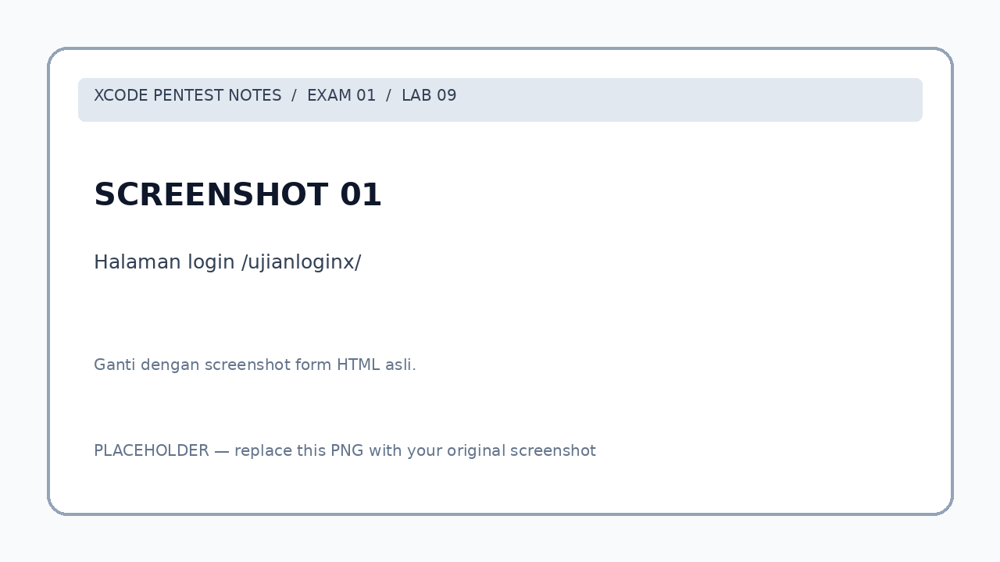
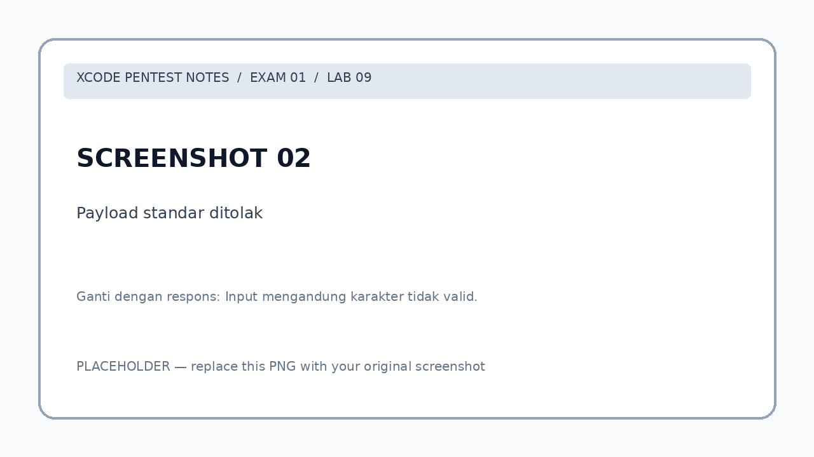
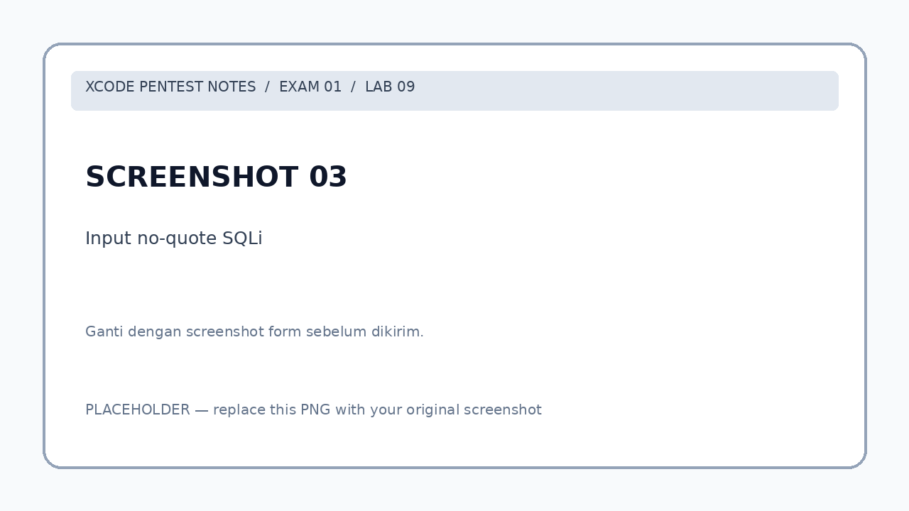
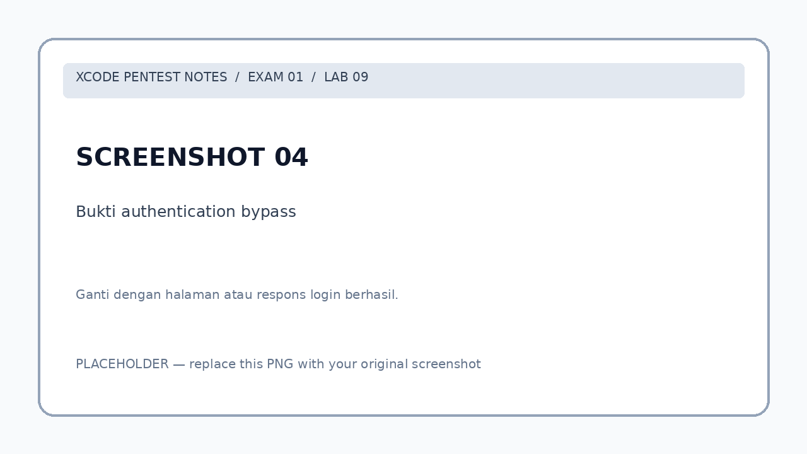
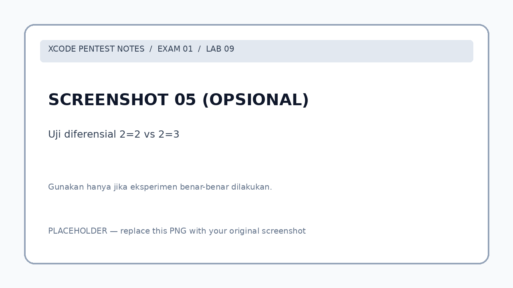

# Lab 09 — No-Quote SQL Injection & Authentication Bypass

  

> **Lingkup:** Lab pentest XCODE Exam 01 pada lingkungan latihan yang diizinkan. Seluruh URL `localhost:8080` dalam dokumen ini merujuk ke akses target melalui SSH tunnel yang telah dikonfigurasi pada Lab 00.
>
> **Status bukti:** Authentication bypass dengan payload utama dilaporkan berhasil. Source code backend tidak tersedia, sehingga rekonstruksi SQL dan implementasi filter di bawah merupakan **hipotesis teknis**, bukan hasil pembacaan source code.

## Daftar isi

1. [Informasi lab](#1-informasi-lab)
2. [Tujuan pembelajaran](#2-tujuan-pembelajaran)
3. [Lingkungan dan halaman target](#3-lingkungan-dan-halaman-target)
4. [Analisis form HTML](#4-analisis-form-html)
5. [Pengujian awal yang gagal](#5-pengujian-awal-yang-gagal)
6. [Temuan tentang filter input](#6-temuan-tentang-filter-input)
7. [Payload utama yang berhasil](#7-payload-utama-yang-berhasil)
8. [Analisis logika SQL](#8-analisis-logika-sql)
9. [Variasi payload dan batasan bukti](#9-variasi-payload-dan-batasan-bukti)
10. [Pengujian diferensial](#10-pengujian-diferensial)
11. [Ringkasan hasil dan bukti](#11-ringkasan-hasil-dan-bukti)
12. [Root cause](#12-root-cause)
13. [Mitigasi untuk developer](#13-mitigasi-untuk-developer)
14. [Hubungan dengan lab sebelumnya](#14-hubungan-dengan-lab-sebelumnya)
15. [Checklist pembelajaran](#15-checklist-pembelajaran)
16. [Kesimpulan](#16-kesimpulan)
17. [Cheat sheet](#17-cheat-sheet)

---

## 1. Informasi lab

| Informasi | Keterangan |
|---|---|
| Lab | 09 |
| Exam | 01 |
| Nama target | `/ujianloginx/` |
| IP lab | `192.168.39.87` |
| URL via tunnel | `http://localhost:8080/ujianloginx/` |
| Metode request | `POST` |
| Input | `username`, `password` |
| Kategori | SQL Injection (SQLi) |
| Teknik | No-Quote SQLi / Boolean-Based Authentication Bypass |
| Status | **Solved** menggunakan payload utama |
| Bukti utama | Payload diterima dan autentikasi berhasil menurut hasil latihan |

## 2. Tujuan pembelajaran

Pada Lab 09, saya mempelajari bagaimana form login dapat tetap rentan terhadap SQL Injection walaupun sebagian karakter dan kata tertentu diblokir oleh validasi input. Tujuan latihan adalah memahami perbedaan antara *input filtering* dan perlindungan query yang benar, serta bagaimana operator Boolean pada SQL dapat memengaruhi proses autentikasi.

Materi yang dipelajari:

- Membaca struktur form HTML dan mengenali metode `POST`.
- Menguji respons aplikasi terhadap input yang berbeda.
- Memahami kelemahan blacklist sebagai pertahanan utama SQLi.
- Memahami teknik SQL Injection tanpa tanda petik (*no-quote SQLi*).
- Menghitung prioritas operator `AND` dan `OR`.
- Membedakan hasil pengamatan, hipotesis backend, dan temuan yang sudah terverifikasi.
- Mempelajari mitigasi menggunakan *prepared statements* dan verifikasi password yang aman.

## 3. Lingkungan dan halaman target

Clue yang diberikan hanya mengarah ke halaman login:

```text
http://192.168.39.87/ujianloginx/
```

Karena aplikasi lab diakses melalui SSH tunnel, pengujian dari laptop menggunakan:

```text
http://localhost:8080/ujianloginx/
```

Alur koneksi:

```text
Laptop / Browser
       |
       v
localhost:8080
       |
       v
   SSH Tunnel
       |
       v
      VPS
       |
       v
192.168.39.87/ujianloginx/
```



*Ganti placeholder dengan screenshot form login ketika halaman pertama kali dibuka.*

## 4. Analisis form HTML

Kode HTML dari clue:

```html
<!DOCTYPE html>
<html>
<head>
    <title>Login Raw SQL Injection - Tricky</title>
</head>
<body>
    <h2>Login Form</h2>
    <form method="POST" action="">
        Username: <input type="text" name="username" /><br />
        Password: <input type="text" name="password" /><br />
        <input type="submit" value="Login" />
    </form>
</body>
</html>
```

| Elemen | Fungsi |
|---|---|
| `method="POST"` | Mengirim input melalui HTTP request body. |
| `action=""` | Biasanya mengirim form ke URL halaman yang sedang dibuka. |
| `name="username"` | Nama parameter username. |
| `name="password"` | Nama parameter password. |
| `<input type="submit">` | Mengirim kedua nilai saat tombol Login ditekan. |

**Catatan:** Field password menggunakan `type="text"`, sehingga isinya terlihat di layar. Ini merupakan kelemahan antarmuka tersendiri; seharusnya menggunakan `type="password"`. Namun, mengganti tipe HTML **tidak** mengatasi SQL Injection pada backend.

HTML hanya memperlihatkan cara data dikirim. Ia **tidak** menunjukkan query SQL, aturan blacklist, maupun logika autentikasi yang sebenarnya dijalankan server.

## 5. Pengujian awal yang gagal

Percobaan pertama mengikuti pola SQL Injection yang sudah dipelajari di Lab 02:

```text
' OR '1'='1
```

Payload tersebut dicoba pada field login `username` dan `password`, tetapi aplikasi memberikan respons:

```html
<h3>Input mengandung karakter tidak valid.</h3>
```



*Ganti placeholder dengan screenshot input dan respons penolakan.*

**Hasil pengamatan:** Aplikasi menolak input tersebut sebelum login berhasil. Respons ini mengindikasikan adanya pemeriksaan input. Akan tetapi, tanpa source code atau pengujian terpisah setiap karakter, belum dapat dipastikan apakah penolakan berasal dari regex PHP, aturan string matching, WAF, atau mekanisme lain.

## 6. Temuan tentang filter input

Berdasarkan catatan eksperimen lanjutan:

| Elemen input | Hasil yang dilaporkan |
|---|---|
| Tanda petik tunggal `'` dan ganda `"` | Diblokir. |
| Komentar `--`, `#`, `/**/` | Diblokir. |
| Tanda kurung `(` dan `)` | Diblokir. |
| Operator `=` | Lolos filter. |
| Kata kunci `OR` | Lolos filter. |

Pesan penolakan:

```text
Input mengandung karakter tidak valid.
```

Dari hasil ini, saya mengubah pendekatan: alih-alih mencoba menutup string menggunakan tanda petik, saya menguji ekspresi Boolean **tanpa tanda petik dan tanpa komentar SQL**.

> **Penting:** Aturan blacklist yang tepat belum bisa dibuktikan dari halaman HTML saja. Tabel di atas merekam hasil uji input yang dilaporkan, bukan kutipan kode filter backend.

## 7. Payload utama yang berhasil

Payload yang digunakan pada form:

| Field | Nilai |
|---|---|
| Username | `1 OR 1=1 OR 1` |
| Password | `1` |

```text
Username: 1 OR 1=1 OR 1
Password: 1
```

Payload ini tidak memakai tanda petik, komentar SQL, atau tanda kurung. Pengujian dilaporkan menghasilkan **login berhasil**.



*Ganti placeholder dengan screenshot input payload utama. Jangan tampilkan cookie sesi atau data rahasia dalam screenshot publik.*



*Ganti placeholder dengan respons atau halaman setelah login berhasil. Jika ada username/role yang tampil, catat apa adanya tanpa menyimpulkan role yang tidak terlihat.*

### Mengapa disebut *No-Quote SQL Injection*?

Teknik ini menyisipkan ekspresi SQL melalui input **tanpa menggunakan tanda petik**. Keberhasilannya konsisten dengan kemungkinan bahwa backend menggabungkan input mentah ke query atau memiliki konstruksi lain yang membuat nilai input dievaluasi sebagai ekspresi SQL. Detail konstruksi sebenarnya perlu source code untuk dipastikan.

## 8. Analisis logika SQL

Sebagai **model hipotesis** untuk memahami keberhasilan tersebut, misalkan backend membangun query tanpa melakukan parameterisasi dan tanpa membungkus input dalam tanda petik:

```sql
SELECT *
FROM users
WHERE username = $username
  AND password = $password;
```

Setelah memasukkan payload utama, bentuk query ilustratifnya menjadi:

```sql
SELECT *
FROM users
WHERE username = 1 OR 1=1 OR 1 AND password = 1;
```

Pada SQL, operator `AND` umumnya memiliki prioritas lebih tinggi daripada `OR`. Kondisi `WHERE` dapat dibaca secara konseptual sebagai:

```sql
(username = 1)
OR (1 = 1)
OR ((1) AND (password = 1))
```

Karena `1=1` bernilai **TRUE**, keseluruhan kondisi menjadi **TRUE** pada model ini:

```text
(username = 1) OR TRUE OR (...)
                 |
                 v
                TRUE
```

Dengan kondisi tersebut, query hipotetis dapat mengembalikan satu atau lebih baris meskipun pasangan username/password normal tidak diketahui. Apabila aplikasi menganggap *ada baris hasil* sama dengan *login valid*, proses autentikasi dapat dilewati.

**Batasan kesimpulan:** Model ini membantu menjelaskan mengapa payload dapat berhasil, tetapi tidak membuktikan query backend persis seperti contoh. Baris pertama yang dikembalikan juga **tidak dapat dipastikan sebagai admin** tanpa bukti respons atau pengurutan database yang jelas.

## 9. Variasi payload dan batasan bukti

Di catatan latihan terdapat variasi yang sempat dipertimbangkan:

```text
Username: 1 OR 1=1
Password: OR 1=1
```

Variasi tersebut **tidak dicatat sebagai temuan yang berhasil** di dokumentasi ini, karena belum tersedia bukti responsnya. Selain itu, jika dimasukkan ke struktur SQL hipotesis pada bagian sebelumnya, ia dapat menghasilkan sintaks tidak valid:

```sql
WHERE username = 1 OR 1=1 AND password = OR 1=1
```

Karena itu, variasi tersebut tidak dapat digunakan sebagai bukti pemilihan user ID tertentu ataupun sebagai bukti login ke akun administrator. Temuan utama Lab 09 tetap payload pada Bagian 7 yang sudah dilaporkan berhasil.

## 10. Pengujian diferensial

Catatan eksperimen juga memuat gagasan membandingkan input berikut untuk melihat perbedaan perilaku aplikasi:

```text
2=2
2=3
```

| Input | Makna logis | Interpretasi pengujian |
|---|---|---|
| `2=2` | TRUE | Dapat dipakai sebagai pembanding respons. |
| `2=3` | FALSE | Dapat dipakai sebagai pembanding respons. |

Perbedaan respons dapat menjadi **indikasi** bahwa aplikasi memproses ekspresi secara berbeda. Namun, perbedaan tersebut **belum cukup untuk membuktikan** bahwa input dieksekusi sebagai SQL; diperlukan bukti tambahan seperti respons yang dapat direproduksi, pemeriksaan kode, atau pengujian terkontrol lainnya.



*Opsional: ganti placeholder dengan screenshot perbandingan respons jika pengujian `2=2` dan `2=3` benar-benar dilakukan.*

## 11. Ringkasan hasil dan bukti

| Tahap | Aktivitas | Status |
|---|---|---|
| 1 | Mengakses form `/ujianloginx/` | Selesai |
| 2 | Mengidentifikasi metode `POST` dan field form | Selesai |
| 3 | Mencoba SQLi standar dengan tanda petik | Ditolak aplikasi |
| 4 | Mengidentifikasi beberapa karakter/operator yang lolos atau diblokir | Tercatat dalam hasil eksperimen |
| 5 | Menggunakan payload tanpa tanda petik | **Berhasil menurut hasil lab** |
| 6 | Melihat source code backend | Belum dilakukan |
| 7 | Membuktikan role akun yang diakses | Belum ada bukti yang dicantumkan |
| 8 | Memverifikasi variasi payload pada Bagian 9 | Belum ada bukti yang dicantumkan |

**Bukti yang perlu dilampirkan sebelum laporan dipublikasikan:** screenshot payload yang ditolak, payload yang berhasil, dan respons/halaman setelah login. Sensor cookie sesi, password asli, token, dan informasi privat lab.

## 12. Root cause

Temuan ini konsisten dengan masalah **SQL Injection akibat query yang dibangun secara tidak aman**, sementara validasi berbasis blacklist tidak cukup membatasi seluruh bentuk ekspresi SQL.

Model masalah:

```text
Input pengguna
      |
      v
Filter berbasis blacklist
      |
      +--> Beberapa pola diblokir
      |
      +--> Ekspresi tanpa tanda petik lolos
                     |
                     v
       Query SQL dibangun tidak aman
                     |
                     v
       Logika autentikasi berubah
                     |
                     v
          Authentication bypass
```

> Detail fungsi filter, database engine, dan konstruksi query tetap harus dikonfirmasi melalui kode backend atau bukti pengujian yang lebih lengkap.

## 13. Mitigasi untuk developer

### A. Gunakan prepared statements

Jangan menyusun query SQL dengan menggabungkan input pengguna secara langsung. Untuk aplikasi PHP, gunakan PDO atau MySQLi prepared statements agar input selalu diperlakukan sebagai **data**, bukan sintaks SQL.

Contoh rancangan yang lebih aman menggunakan PDO dan password hash:

```php
<?php
// Diasumsikan $pdo adalah koneksi PDO yang sudah dikonfigurasi.
$username = $_POST['username'] ?? '';
$password = $_POST['password'] ?? '';

$stmt = $pdo->prepare(
    'SELECT id, username, password_hash, role
     FROM users
     WHERE username = :username
     LIMIT 1'
);
$stmt->execute(['username' => $username]);
$user = $stmt->fetch(PDO::FETCH_ASSOC);

if ($user && password_verify($password, $user['password_hash'])) {
    // Buat sesi login dan rotasi session ID sesuai kebijakan aplikasi.
    echo 'Login berhasil.';
} else {
    echo 'Username atau password salah.';
}
```

Password baru sebaiknya disimpan dengan `password_hash()`, **bukan plaintext**. Verifikasi login menggunakan `password_verify()`. Pengelolaan sesi, rate limiting, dan logging kegagalan login juga tetap diperlukan.

### B. Jangan bergantung pada blacklist

Blacklist tidak dapat dianggap sebagai pengganti parameterisasi. Memblokir tanda petik atau komentar belum tentu menutup seluruh bentuk SQL Injection. Validasi input tetap berguna untuk aturan bisnis dan tipe data, tetapi bukan kontrol utama terhadap SQL Injection.

### C. Terapkan validasi tipe data sesuai kontrak

Jika sebuah parameter memang harus berupa angka, validasi sebagai integer dan tolak nilai lain. Namun, **type casting saja bukan mitigasi lengkap untuk seluruh SQL Injection**, terutama ketika query juga menggunakan parameter string atau konstruksi SQL dinamis lainnya.

### D. Perkuat autentikasi

- Gunakan password hashing yang sesuai.
- Gunakan akun database dengan hak akses minimum.
- Terapkan pembatasan percobaan login dan monitoring.
- Uji kode dengan pengujian keamanan otomatis dan review query.
- Gunakan pesan kegagalan login yang tidak membocorkan detail sensitif.

## 14. Hubungan dengan lab sebelumnya

| Lab | Materi | Hubungan dengan Lab 09 |
|---|---|---|
| Lab 00 | SSH & Tunneling | Akses ke environment lab melalui tunnel. |
| Lab 02 | SQL Injection login | Mengenalkan payload standar berbasis tanda petik. |
| Lab 04 | Dictionary Attack | Pendekatan pengujian login melalui percobaan kredensial, bukan perubahan query. |
| Lab 07 | API Source Disclosure & SQLi | Menganalisis query login rentan dari source code yang berhasil dibaca. |
| **Lab 09** | **No-Quote SQLi** | SQLi tetap terjadi walaupun tanda petik dan komentar ditolak oleh filter. |

## 15. Checklist pembelajaran

- [ ] Saya dapat menjelaskan fungsi `method="POST"` dan `name="username"` pada HTML.
- [ ] Saya dapat membedakan HTML frontend dengan implementasi SQL di backend.
- [ ] Saya memahami mengapa payload SQLi awal ditolak.
- [ ] Saya memahami perbedaan blacklist dan prepared statement.
- [ ] Saya memahami apa yang dimaksud *No-Quote SQL Injection*.
- [ ] Saya dapat menjelaskan mengapa `1=1` bernilai TRUE.
- [ ] Saya memahami prioritas `AND` terhadap `OR` dalam SQL.
- [ ] Saya dapat membedakan hasil pengujian nyata dari query backend yang masih hipotetis.
- [ ] Saya memahami mengapa sukses login tidak otomatis membuktikan akun admin yang dipilih.
- [ ] Saya memahami fungsi `password_hash()` dan `password_verify()` pada PHP.

## 16. Kesimpulan

Pada Lab 09, payload SQL Injection yang menggunakan tanda petik ditolak dengan pesan `Input mengandung karakter tidak valid.`. Setelah menganalisis perilaku filter, saya mencoba pendekatan tanpa tanda petik, menggunakan operator `OR` dan kondisi `1=1`. Berdasarkan hasil latihan, pendekatan tersebut berhasil melewati autentikasi.

Hal terpenting yang saya pelajari adalah bahwa **memblokir beberapa karakter berbahaya tidak sama dengan memisahkan input dari struktur query SQL**. Perlindungan yang tepat harus diterapkan pada backend, terutama melalui prepared statements, pengelolaan password yang aman, dan validasi data sesuai kebutuhan aplikasi.

## 17. Cheat sheet

```text
LAB             : 09
EXAM            : 01
TARGET          : /ujianloginx/
METHOD          : POST
INPUT           : username, password
CATEGORY        : SQL Injection
TECHNIQUE       : No-Quote SQLi / Authentication Bypass
FAILED ATTEMPT  : ' OR '1'='1
FAILURE MESSAGE : Input mengandung karakter tidak valid.
WORKING USER    : 1 OR 1=1 OR 1
WORKING PASS    : 1
RESULT          : Authentication bypass (sesuai hasil lab)
BACKEND QUERY   : Hipotesis; belum dibaca langsung
MAIN DEFENSE    : Prepared Statements + Secure Password Handling
```

### Mental model

```text
Input dengan tanda petik
          |
          v
      Ditolak filter
          |
          v
Uji ekspresi tanpa tanda petik
          |
          v
  Input lolos filter
          |
          v
 Logika query berubah
          |
          v
 Authentication bypass
```

---

**Navigasi:** [Lab 08 — API LFI](../lab-08-api-lfi/README.md) · [README Exam 01](../README.md)
