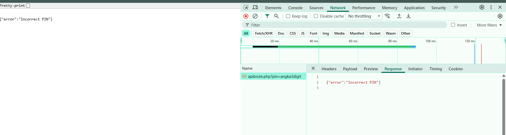
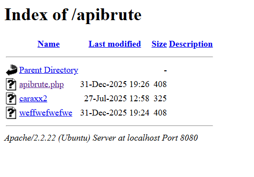
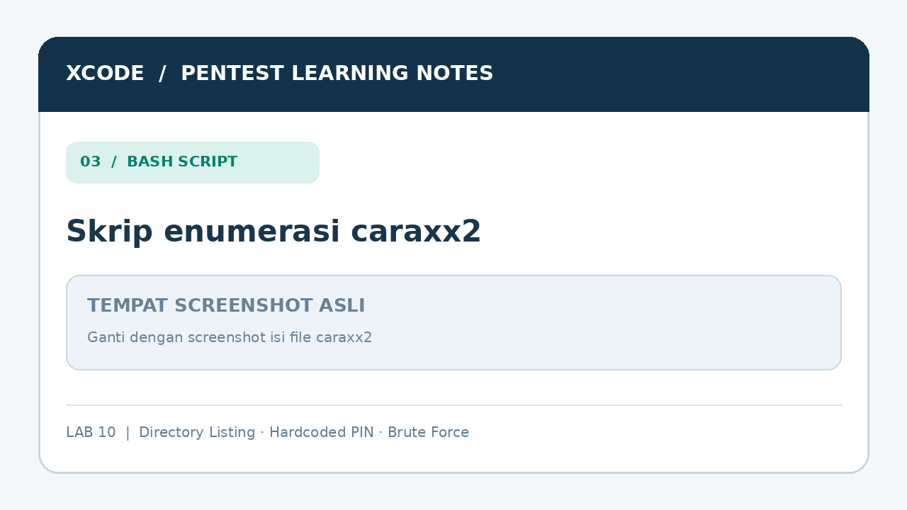
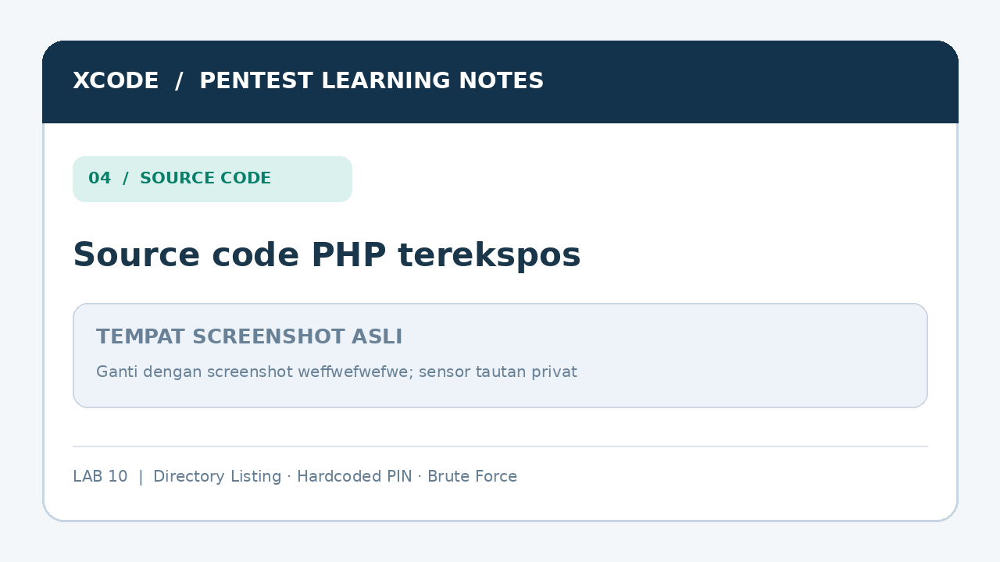

# Lab 10 — API PIN Brute Force & Information Disclosure

  

> **Lingkup:** Pembelajaran penetration testing pada lab XCODE yang memang diizinkan. URL `localhost:8080` pada dokumen ini mengasumsikan SSH tunnel dari Lab 00 sudah aktif dan diteruskan ke web server lab.
>
> **Status bukti:** Directory listing, isi file `caraxx2`, isi file `weffwefwefwe`, serta respons `Incorrect PIN` tersedia dalam catatan pengujian. Source code yang terekspos menunjukkan PIN `362`. **Respons sukses dari endpoint setelah PIN tersebut dikirim belum dilampirkan** dalam catatan ini. Keberadaan atau ketiadaan *rate limiting* juga belum dibuktikan melalui pengujian terpisah.
>
> **Publikasi:** Jangan mengunggah tautan undangan WhatsApp lengkap, token, cookie, atau kredensial nyata ke repository publik. Contoh respons sukses dalam dokumen ini menggunakan placeholder `[REDACTED]`.

## Daftar isi

1. [Informasi lab](#1-informasi-lab)
2. [Tujuan pembelajaran](#2-tujuan-pembelajaran)
3. [Lingkungan dan clue awal](#3-lingkungan-dan-clue-awal)
4. [Analisis respons PIN salah](#4-analisis-respons-pin-salah)
5. [Directory Listing pada /apibrute/](#5-directory-listing-pada-apibrute)
6. [Analisis file caraxx2 (Bash)](#6-analisis-file-caraxx2-bash)
7. [Analisis source code weffwefwefwe (PHP)](#7-analisis-source-code-weffwefwefwe-php)
8. [Mengapa PIN tiga digit mudah ditebak](#8-mengapa-pin-tiga-digit-mudah-ditebak)
9. [Verifikasi PIN dan batasan bukti](#9-verifikasi-pin-dan-batasan-bukti)
10. [Rangkaian temuan dan klasifikasi](#10-rangkaian-temuan-dan-klasifikasi)
11. [Root cause](#11-root-cause)
12. [Mitigasi](#12-mitigasi)
13. [Ringkasan hasil dan bukti](#13-ringkasan-hasil-dan-bukti)
14. [Hubungan dengan lab sebelumnya](#14-hubungan-dengan-lab-sebelumnya)
15. [Checklist dan latihan pemahaman](#15-checklist-dan-latihan-pemahaman)
16. [Kesimpulan](#16-kesimpulan)
17. [Cheat sheet](#17-cheat-sheet)

---

## 1. Informasi lab

| Informasi | Keterangan |
|---|---|
| Lab | 10 |
| Target directory | `/apibrute/` |
| Endpoint | `/apibrute/apibrute.php` |
| Metode request | `GET` |
| Parameter | `pin` |
| Input yang diminta | PIN tiga digit (`000`–`999`) |
| Format respons | JSON |
| Indikator kegagalan | `{"error":"Incorrect PIN"}` |
| File yang ditemukan | `apibrute.php`, `caraxx2`, `weffwefwefwe` |
| Temuan terkonfirmasi dari catatan | Directory Listing dan Source Code Disclosure |
| Kerentanan yang dipelajari | Hardcoded Secret dan risiko PIN Brute Force |
| Status | PIN terungkap dari source code; bukti respons sukses API belum dilampirkan |

## 2. Tujuan pembelajaran

Pada Lab 10, saya mempelajari bagaimana informasi yang tidak seharusnya dipublikasikan dapat terungkap ketika web server memperlihatkan isi direktori dan menyajikan file pendukung aplikasi secara langsung.

Tujuan latihan:

- Memahami *Directory Listing* pada web server Apache.
- Menganalisis file pendukung yang ditemukan melalui directory listing.
- Membaca skrip Bash yang mengotomatisasi pengujian PIN tiga digit.
- Mengidentifikasi *hardcoded secret* di dalam source code PHP.
- Membedakan informasi yang sudah diamati dari asumsi tentang backend dan rate limiting.
- Memahami mengapa PIN pendek membutuhkan kontrol percobaan yang kuat.
- Menyusun rekomendasi perbaikan untuk aplikasi web dan konfigurasi server.

## 3. Lingkungan dan clue awal

Clue dari lab:

```text
http://localhost:8080/apibrute/apibrute.php?pin=angka3digit
```

`angka3digit` adalah placeholder untuk masukan berupa tiga angka, misalnya `001` atau `362`.

Contoh alur akses apabila menggunakan SSH tunnel:

```text
Laptop penguji
      |
      v
localhost:8080
      |
      v
SSH tunnel -> VPS
      |
      v
Web server lab
      |
      v
/apibrute/apibrute.php?pin=...
```

**Catatan tentang `localhost`:** Pada laptop dengan tunnel, `localhost:8080` adalah port lokal laptop. Pada VPS, `localhost` merujuk ke VPS itu sendiri. Karena itu, alamat di dalam skrip perlu disesuaikan dengan lokasi skrip dijalankan.



*Ganti dengan screenshot URL clue dan JSON `Incorrect PIN`.*

## 4. Analisis respons PIN salah

Ketika PIN tidak sesuai, endpoint memberikan respons:

```json
{
  "error": "Incorrect PIN"
}
```

Respons tersebut menunjukkan bahwa nilai parameter `pin` dibandingkan dengan suatu nilai yang dianggap benar oleh aplikasi.

Pada tahap ini, saya **belum** mengetahui apakah aplikasi menyimpan PIN dalam database, konfigurasi, atau source code. Saya baru mengetahui bentuk input dan indikator kegagalannya.

| Elemen | Makna |
|---|---|
| `GET` | Nilai PIN dikirim melalui query string URL. |
| `pin=` | Parameter yang diperiksa server. |
| JSON `error` | Respons aplikasi untuk nilai PIN yang salah. |
| `Incorrect PIN` | Penanda kegagalan, bukan HTTP status code. |

Menggunakan `GET` untuk sebuah PIN juga berisiko membuat nilainya tercatat di riwayat browser, proxy, atau access log. Untuk sistem nyata, rahasia autentikasi tidak seharusnya diletakkan dalam URL.

## 5. Directory Listing pada /apibrute/

Saya memotong URL clue dari endpoint menjadi direktori induknya:

```text
http://localhost:8080/apibrute/
```

Alih-alih menampilkan aplikasi utama atau menolak akses, server menampilkan halaman:

```text
Index of /apibrute
```

Dari daftar tersebut, terdapat tiga file penting:

| File | Informasi yang ditemukan |
|---|---|
| `apibrute.php` | Endpoint pemeriksaan PIN. |
| `caraxx2` | Skrip Bash untuk mencoba rentang PIN tiga digit. |
| `weffwefwefwe` | Teks source code PHP yang menunjukkan cara pemeriksaan PIN. |

Halaman juga menampilkan banner `Apache/2.2.22 (Ubuntu)` sesuai respons yang tercatat. Banner ini merupakan informasi versi yang diungkap server; **versi saja tidak membuktikan adanya kerentanan tertentu**.

Istilah untuk kondisi direktori yang terbuka ini adalah **Directory Listing** atau **Directory Indexing**.



*Ganti dengan screenshot `Index of /apibrute` yang memperlihatkan ketiga file.*

**Penting:** Directory Listing sendiri mengungkap nama dan metadata file. Pengungkapan source code terjadi karena file `weffwefwefwe` **juga dapat dibuka dan disajikan sebagai teks**. Keduanya merupakan temuan yang berkaitan, tetapi tidak identik.

## 6. Analisis file caraxx2 (Bash)

Saya membuka file:

```text
http://localhost:8080/apibrute/caraxx2
```

Isi skrip yang ditemukan:

```bash
#!/bin/bash

URL="http://localhost/apibrute/apibrute.php"  # sesuaikan dengan lokasi eksekusi

for i in $(seq -w 0 999); do
    echo "Trying PIN: $i"
    response=$(curl -s "$URL?pin=$i")

    if [[ $response == *"flag"* ]]; then
        echo "[+] Found PIN: $i"
        echo "Response: $response"
        break
    fi
done
```

Skrip ini merupakan contoh **PIN Enumeration / Exhaustive Search** menggunakan Bash dan cURL.

### 6.1 Penjelasan setiap bagian

| Bagian | Fungsi |
|---|---|
| `#!/bin/bash` | Menentukan Bash sebagai interpreter. |
| `URL=...` | Menentukan endpoint yang akan diuji. |
| `seq -w 0 999` | Menghasilkan urutan `000` hingga `999`, dengan panjang angka yang disamakan. |
| `for i in ...` | Mengulangi percobaan untuk setiap kandidat PIN. |
| `curl -s` | Mengirim HTTP request tanpa progress meter. |
| `response=$(...)` | Menyimpan response body ke variabel `response`. |
| `*"flag"*` | Memeriksa apakah respons mengandung teks `flag`. |
| `break` | Menghentikan perulangan ketika kondisi cocok. |

Karena `seq -w` menambahkan nol di depan sesuai lebar angka terbesar, keluaran untuk rentang tersebut berbentuk `000`, `001`, ..., `999`. Hal ini penting bila server membandingkan PIN sebagai **string**: `007` tidak sama dengan `7`.

### 6.2 Penyesuaian URL untuk tunnel

Jika skrip dijalankan **di laptop** yang memiliki SSH tunnel pada port `8080`, ubah URL menjadi:

```bash
URL="http://localhost:8080/apibrute/apibrute.php"
```

Jika skrip dijalankan **langsung di VPS**, `localhost` akan mengarah ke VPS. URL harus menggunakan alamat web server yang benar-benar dapat dijangkau dari VPS, sesuai instruksi lab.

### 6.3 Batasan skrip

Pencarian teks `flag` merupakan indikator yang digunakan pembuat skrip. Pencocokan tersebut bisa salah apabila respons error ternyata juga mengandung kata yang sama. Hasil harus diverifikasi dengan memeriksa JSON dan perilaku endpoint.

File `caraxx2` menunjukkan **cara** mencoba 1.000 kombinasi; keberadaan file tersebut tidak membuktikan bahwa seluruh percobaan telah benar-benar dijalankan pada sesi pengujian ini.



*Ganti dengan screenshot file `caraxx2` atau skrip yang dibuka di VS Code.*

## 7. Analisis source code weffwefwefwe (PHP)

File berikut ternyata juga dapat dibuka sebagai teks:

```text
http://localhost:8080/apibrute/weffwefwefwe
```

Bagian source code penting yang ditemukan, dengan tautan undangan disensor:

```php
<?php
// Contoh API brute force sederhana, tanpa database.
$correct_pin = "362";

$pin = isset($_GET['pin']) ? $_GET['pin'] : '';
header('Content-Type: application/json');

if ($pin === $correct_pin) {
    echo json_encode([
        "flag" => "https://chat.whatsapp.com/[REDACTED]"
    ]);
} else {
    echo json_encode(["error" => "Incorrect PIN"]);
}
?>
```

### 7.1 Temuan: Hardcoded Secret

Baris yang paling penting:

```php
$correct_pin = "362";
```

PIN diletakkan langsung dalam source code. Karena isi file ini dapat diakses melalui web, nilai PIN terungkap tanpa perlu menjalankan percobaan terhadap seluruh kombinasi.

Istilah teknisnya adalah **Hardcoded Secret** (PIN yang disimpan secara langsung dalam kode) dan **Source Code Disclosure** (kode sumber yang terekspos kepada pengguna web).

**Catatan pembuktian:** File `weffwefwefwe` tampak berisi implementasi yang sesuai dengan clue API. Namun, tanpa memeriksa file `apibrute.php` yang benar-benar dieksekusi, kita tidak dapat memastikan keduanya identik hanya dari directory listing. Verifikasi respons endpoint akan memperkuat hubungan tersebut.

### 7.2 Analisis operator perbandingan

Kode PHP menggunakan:

```php
if ($pin === $correct_pin)
```

Operator `===` membandingkan **nilai sekaligus tipe data**. Karena `$_GET['pin']` biasanya berupa string, nilai `"362"` akan cocok dengan `"362"`, sedangkan angka tiga digit yang berbeda akan menghasilkan respons error.

### 7.3 Analisis respons JSON

Jika nilai PIN cocok menurut source code yang ditemukan, bentuk respons yang diharapkan adalah:

```json
{
  "flag": "https://chat.whatsapp.com/[REDACTED]"
}
```

Jika tidak cocok:

```json
{
  "error": "Incorrect PIN"
}
```

Respons sukses di atas adalah **ekspektasi berdasarkan kode yang dibaca**, bukan transkrip respons sukses yang dilampirkan dalam catatan awal.



*Ganti dengan screenshot file `weffwefwefwe` yang menunjukkan logika `if`, parameter `pin`, dan PIN hardcoded. Sensor tautan privat.*

## 8. Mengapa PIN tiga digit mudah ditebak?

Setiap digit memiliki 10 kemungkinan (`0` sampai `9`). Untuk PIN dengan tiga posisi:

```text
10 × 10 × 10 = 1.000 kemungkinan
```

Rentangnya:

```text
000, 001, 002, ..., 998, 999
```

Ruang pencarian 1.000 kemungkinan tergolong kecil. Jika suatu endpoint membolehkan percobaan tanpa kontrol, seluruh ruang PIN dapat dicoba menggunakan otomasi sederhana.

Namun **ketiadaan rate limiting belum dibuktikan** oleh materi yang diberikan. Potongan PHP yang terekspos memang tidak menampilkan pembatasan percobaan, tetapi kontrol dapat saja diterapkan di reverse proxy, web server, gateway, atau komponen lain.

Pada lab ini, karena PIN sudah terekspos dari file PHP, pencarian menyeluruh bahkan tidak diperlukan untuk mengetahui kandidat PIN yang benar.

## 9. Verifikasi PIN dan batasan bukti

Untuk melengkapi bukti pada lab yang diizinkan, kirim satu request menggunakan PIN yang ditemukan pada source code:

```bash
curl -i "http://localhost:8080/apibrute/apibrute.php?pin=362"
```

Apabila endpoint menggunakan logika yang sama dengan file `weffwefwefwe`, respons yang diharapkan berbentuk:

```json
{
  "flag": "https://chat.whatsapp.com/[REDACTED]"
}
```

Saat memasukkan screenshot asli, catat respons server **apa adanya**. Jangan menyalin respons perkiraan sebagai hasil observasi jika request belum dilakukan.


*Ganti dengan screenshot hasil satu request menggunakan PIN dari source code. Jika belum melakukan verifikasi, pertahankan placeholder ini.*

## 10. Rangkaian temuan dan klasifikasi

Urutan aktivitas pada lab ini:

```text
Clue endpoint PIN
        |
        v
Respons "Incorrect PIN"
        |
        v
Buka direktori /apibrute/
        |
        v
Directory Listing
        |
        +--------------------+
        |                    |
        v                    v
     caraxx2          weffwefwefwe
 (skrip Bash)         (kode PHP)
        |                    |
        v                    v
  Pola enumerasi       PIN hardcoded
   000–999                 362
        |                    |
        +---------+----------+
                  |
                  v
          Kandidat PIN diketahui
                  |
                  v
        Verifikasi endpoint API
```

Klasifikasi yang digunakan:

| Istilah | Hubungan dengan lab | Status bukti |
|---|---|---|
| Directory Listing | Server memperlihatkan daftar isi `/apibrute/`. | Teramati. |
| Source Code Disclosure | File teks memperlihatkan kode PHP aplikasi. | Teramati. |
| Hardcoded Secret | Source code berisi PIN `362`. | Teramati pada file. |
| PIN Enumeration | Skrip Bash mencoba PIN `000`–`999`. | Teknik dijelaskan oleh file; log eksekusi belum dilampirkan. |
| Brute Force Risk | Ruang PIN hanya 1.000 kombinasi. | Risiko berdasarkan desain input. |
| Missing Rate Limiting | Tidak ada kontrol yang terlihat pada snippet PHP. | **Belum terkonfirmasi pada deployment.** |

Ini merupakan contoh **vulnerability chaining**: pengungkapan direktori membantu menemukan file yang kemudian membocorkan informasi penting untuk mengakses endpoint.

## 11. Root cause

Penyebab yang dapat diidentifikasi dari bukti:

1. **Direktori web dapat diindeks.** Server memperlihatkan file yang tersimpan di dalam `/apibrute/`.
2. **File pendukung tersedia di bawah web root.** Skrip Bash dan kode PHP dapat dibaca melalui HTTP.
3. **PIN ditempatkan langsung dalam source code.** Eksposur kode berarti eksposur rahasia yang sama.
4. **Ruang PIN sangat kecil.** Jika digunakan tanpa kontrol percobaan, PIN tiga digit rentan ditebak secara otomatis.

Tidak semua masalah ini harus muncul bersamaan pada suatu sistem nyata. Akan tetapi, dalam kasus lab ini, kombinasinya membuat rahasia autentikasi mudah ditemukan.

## 12. Mitigasi

### 12.1 Nonaktifkan Directory Listing

Untuk Apache, administrator dapat menonaktifkan penampilan indeks direktori pada konfigurasi yang sesuai:

```apache
<Directory "/var/www/html/apibrute">
    Options -Indexes
</Directory>
```

Konfigurasi ini mencegah tampilan `Index of /apibrute`, tetapi **tidak otomatis mencegah akses langsung** ke file yang namanya sudah diketahui.

### 12.2 Jangan menaruh file internal di web root

Skrip pengujian, file cadangan, konfigurasi, dan salinan source code tidak boleh tersedia sebagai aset yang dapat diunduh publik. Pindahkan ke lokasi di luar document root dan terapkan aturan akses yang tepat.

Jangan menganggap nama acak seperti `weffwefwefwe` sebagai pengaman; nama file tetap dapat ditemukan melalui directory listing, tautan, atau kebocoran lain.

### 12.3 Jangan hardcode PIN atau rahasia

PIN, token, dan rahasia aplikasi harus dikelola melalui mekanisme penyimpanan konfigurasi/secret yang aman, dengan izin akses terbatas dan prosedur rotasi. Setelah suatu rahasia terekspos, **ganti atau cabut rahasia tersebut**; sekadar menghapus file yang bocor tidak cukup.

Untuk sistem autentikasi nyata, PIN statis tiga digit saja bukan kontrol yang memadai. Gunakan mekanisme autentikasi yang lebih kuat sesuai tingkat risiko.

### 12.4 Batasi percobaan autentikasi

Terapkan kontrol di sisi server seperti:

- Batas jumlah percobaan dan penundaan progresif.
- Pembatasan berdasarkan akun, sumber permintaan, dan konteks risiko.
- Lockout atau mekanisme verifikasi tambahan yang dirancang agar tidak mudah digunakan untuk mengganggu pengguna lain.
- Logging, alerting, dan pemantauan percobaan berulang.

Pengendalian ini harus diverifikasi pada sistem yang benar-benar berjalan, termasuk bila diterapkan oleh API gateway atau reverse proxy.

### 12.5 Jangan meletakkan PIN dalam URL

PIN autentikasi sebaiknya tidak dikirim lewat query string karena URL dapat muncul dalam browser history dan access log. Gunakan desain autentikasi yang sesuai dan hindari pencatatan informasi sensitif dalam log.

## 13. Ringkasan hasil dan bukti

| No. | Aktivitas | Hasil | Bukti |
|---|---|---|---|
| 1 | Membuka endpoint dengan PIN tidak tepat | `Incorrect PIN` | Screenshot 01 |
| 2 | Membuka `/apibrute/` | Directory Listing muncul | Screenshot 02 |
| 3 | Membuka `caraxx2` | Skrip Bash enumerasi PIN tampil | Screenshot 03 |
| 4 | Membuka `weffwefwefwe` | Source code PHP dan PIN `362` tampil | Screenshot 04 |
| 5 | Memeriksa PIN pada endpoint | Perlu screenshot respons aktual | Screenshot 05 |
| 6 | Merangkum temuan dan mitigasi | Analisis dokumentasi | Screenshot 06 (opsional) |


*Opsional: ganti dengan screenshot hasil akhir lab atau catatan pemeriksaan yang telah disensor.*

## 14. Hubungan dengan lab sebelumnya

| Lab | Materi | Hubungan dengan Lab 10 |
|---|---|---|
| 00 | SSH & Tunneling | Mengakses target melalui jaringan lab. |
| 02 | SQL Injection | Memahami bahwa bypass login berbeda dari menebak PIN. |
| 04 | Dictionary Attack | Memahami otomasi permintaan dan indikator keberhasilan. |
| 05 | Arbitrary File Read | Sama-sama berkaitan dengan paparan file, tetapi melalui mekanisme berbeda. |
| 07 | Source Code Disclosure | Menganalisis kode yang berhasil ditemukan dari celah web. |
| 10 | Directory Listing & PIN Enumeration | Menggabungkan penemuan file, analisis source code, dan risiko PIN lemah. |

Lab 07 memperoleh source code menggunakan PHP filter. Sementara pada Lab 10, file pendukung dapat ditemukan melalui directory listing dan salah satunya dapat diakses langsung sebagai teks.

## 15. Checklist dan latihan pemahaman

### Checklist

- [ ] Saya memahami fungsi parameter `pin` pada endpoint.
- [ ] Saya dapat menjelaskan arti respons `Incorrect PIN`.
- [ ] Saya memahami apa itu Directory Listing.
- [ ] Saya dapat membedakan Directory Listing dari Source Code Disclosure.
- [ ] Saya memahami cara kerja `seq -w 0 999` pada Bash.
- [ ] Saya mengetahui mengapa nol di depan penting untuk PIN bertipe string.
- [ ] Saya memahami fungsi `curl -s`, kondisi `flag`, dan `break` pada skrip.
- [ ] Saya dapat menjelaskan risiko hardcoded PIN.
- [ ] Saya dapat menghitung jumlah kemungkinan PIN tiga digit.
- [ ] Saya memahami mengapa rate limiting tidak bisa dinyatakan tidak ada tanpa verifikasi.
- [ ] Saya mengetahui mitigasi pada konfigurasi Apache dan aplikasi.
- [ ] Saya telah menyensor tautan undangan sebelum memublikasikan dokumentasi.

### Latihan

**1.** Mengapa membuka direktori `/apibrute/` menghasilkan informasi tambahan, padahal clue awal hanya menampilkan endpoint `apibrute.php`?

**2.** Apa perbedaan antara mengetahui nama file dan dapat membaca isi source code file tersebut?

**3.** Mengapa `seq -w 0 999` digunakan, bukan hanya urutan angka tanpa nol di depan?

**4.** Apakah menonaktifkan Directory Listing saja sudah cukup jika file `weffwefwefwe` tetap dapat diunduh dengan URL langsung?

**5.** Mengapa tidak tepat menyimpulkan bahwa tidak ada rate limiting hanya dari source code PHP yang ditemukan?

## 16. Kesimpulan

Pada Lab 10, saya memulai dari clue endpoint pemeriksaan PIN tiga digit yang mengembalikan `Incorrect PIN` untuk input salah. Ketika membuka direktori induknya, saya menemukan Directory Listing yang mengungkap file `apibrute.php`, `caraxx2`, dan `weffwefwefwe`.

File `caraxx2` berisi skrip Bash untuk mencoba seluruh kombinasi PIN `000`–`999`, sementara `weffwefwefwe` menampilkan source code PHP yang berisi PIN hardcoded `362`. Dengan demikian, temuan source code disclosure sudah memberikan kandidat PIN tanpa perlu menjalankan brute force penuh.

**Pelajaran utama:** Perlindungan endpoint tidak cukup apabila file pendukung dan rahasia yang digunakan untuk autentikasi masih dapat diakses melalui web. Directory Listing, penyimpanan file yang tidak aman, dan hardcoded secret dapat saling memperkuat dampak keamanan.

## 17. Cheat sheet

```text
LAB                 : 10
TARGET DIRECTORY    : /apibrute/
TARGET ENDPOINT     : /apibrute/apibrute.php
PARAMETER           : pin
INPUT               : 3 digit (000–999)
ERROR RESPONSE      : {"error":"Incorrect PIN"}
EXPOSED FILES       : caraxx2, weffwefwefwe
OBSERVED PIN        : 362 (dari source code yang terekspos)
CONFIRMED FINDINGS  : Directory Listing, Source Code Disclosure
RELATED RISK        : Hardcoded Secret, PIN Brute Force
PENDING EVIDENCE    : Respons sukses API; pengujian rate limiting
MAIN DEFENSE        : Nonaktifkan listing, lindungi source code,
                      kelola secret, perkuat autentikasi,
                      batasi percobaan login
```

**Mental model:**

```text
Directory Listing
       |
       v
File internal terekspos
       |
       v
Source code & PIN ditemukan
       |
       v
Autentikasi berisiko dilewati
       |
       v
Perbaikan: lindungi file + rahasia + endpoint
```
